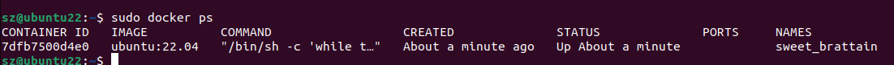

# Docker 架构

- **镜像（Image）**：Docker 镜像（Image），就相当于是一个 root 文件系统。比如官方镜像 ubuntu:16.04 就包含了完整的一套 Ubuntu16.04 最小系统的 root 文件系统。
- **容器（Container）**：镜像（Image）和容器（Container）的关系，就像是面向对象程序设计中的类和实例一样，镜像是静态的定义，容器是镜像运行时的实体。容器可以被创建、启动、停止、删除、暂停等。
- **仓库（Repository）**：仓库可看成一个代码控制中心，用来保存镜像。


- **Docker 镜像(Images)**:Docker 镜像是用于创建 Docker 容器的模板，比如 Ubuntu 系统
- **Docker 容器(Container)**:容器是独立运行的一个或一组应用，是镜像运行时的实体。
- **Docker 客户端(Client)**:Docker 客户端通过命令行或者其他工具使用 Docker SDK (https://docs.docker.com/develop/sdk/) 与 Docker 的守护进程通信。
- **Docker 主机(Host)**:一个物理或者虚拟的机器用于执行 Docker 守护进程和容器。
- **Docker Registry**：Docker 仓库用来保存镜像，可以理解为代码控制中的代码仓库。Docker Hub([https://hub.docker.com](https://hub.docker.com/)) 提供了庞大的镜像集合供使用。一个 Docker Registry 中可以包含多个仓库（Repository）；每个仓库可以包含多个标签（Tag）；每个标签对应一个镜像。
- **Docker Machine**：Docker Machine是一个简化Docker安装的命令行工具，通过一个简单的命令行即可在相应的平台上安装Docker，比如VirtualBox、 Digital Ocean、Microsoft Azure。

# Ubuntu安装Docker

#### 使用官方的脚本安装

```linux
curl -fsSL https://get.docker.com | bash -s docker --mirror Aliyun
```

#### 使用国内 daocloud 一键安装命令

```linux
curl -sSL https://get.daocloud.io/docker | sh
```

#### 设置仓库

```java
sudo apt-get install \
    apt-transport-https \
    ca-certificates \
    curl \
    gnupg-agent \
    software-properties-common
```

#### 安装 Docker Engine-Community

```java
sudo apt-get install docker-ce docker-ce-cli containerd.io
```

#### 测试安装成功

```java
 sudo docker run hello-world
```


#### 卸载

Docker 的旧版本被称为 docker，docker.io 或 docker-engine 

```java
//卸载旧版本
sudo apt-get remove docker docker-engine docker.io containerd runc
//删除安装包：
sudo apt-get purge docker-ce
//删除镜像、容器、配置文件等内容：
sudo rm -rf /var/lib/docker
```


# Docker Hello World

## 获取镜像

如果我们本地没有 ubuntu 镜像，我们可以使用 docker pull 命令来载入 ubuntu 镜像：

```
$ docker pull ubuntu
```

## 运行容器（自动下载创建容器）

```
docker run ubuntu:22.04 /bin/echo "Hello world"
```

- **docker:** Docker 的二进制执行文件。
- **run:** 与前面的 docker 组合来运行一个容器。
- **ubuntu:22.04** 指定要运行的镜像，Docker 首先从本地主机上查找镜像是否存在，如果不存在，Docker 就会从镜像仓库 Docker Hub 下载公共镜像。
- **/bin/echo "Hello world":** 在启动的容器里执行的命令

## 运行交互式的容器

我们通过 docker 的两个参数 -i -t，让 docker 运行的容器实现**"对话"**的能力：

```
docker run -i -t ubuntu:22.04 /bin/bash
```


exit：退出docker容器

## 启动容器（后台模式）

使用以下命令创建一个以进程方式运行的容器

```
docker run -d ubuntu:22.04 /bin/sh -c "while true; do echo hello world; sleep 1; done"
```


**docker ps** 查看正在运行的容器



**CONTAINER ID:** 容器 ID。

**IMAGE:** 使用的镜像。

**COMMAND:** 启动容器时运行的命令。

**CREATED:** 容器的创建时间。

**STATUS:** 容器状态。

状态有7种：

- created（已创建）
- restarting（重启中）
- running 或 Up（运行中）
- removing（迁移中）
- paused（暂停）
- exited（停止）
- dead（死亡）

**PORTS:** 容器的端口信息和使用的连接类型（tcp\udp）。

**NAMES:** 自动分配的容器名称。


在宿主主机内使用 **docker logs** 命令，查看容器内的标准输出：

\

## 停止容器

```xml
sudo docker stop 7dfb7500d4e0
```

## 查看所有的容器命令如下

```
 docker ps -a
```


## docker start 启动一个已停止的容器

```
docker start b750bbbcfd88 
```

## 进入容器

在使用 **-d** 参数时，容器启动后会进入后台。此时想要进入容器，可以通过以下指令进入：

- **docker attach**
- **docker exec**：推荐大家使用 docker exec 命令，因为此命令会退出容器终端，但不会导致容器的停止。

```java
docker attach 1e560fca3906 //  不知道为啥 ubuntu 可以  mysql使用时 不可以
docker exec -it 243c32535da7 /bin/bash   //通过容器id或者名字
```

## 退出容器，并且不关闭

**ctrl+p+q**

## 导出和导入容器

```java
//导出到本地 ubuntu.tar
docker export 1e560fca3906 > ubuntu.tar
//可以使用 docker import 从容器快照文件中再导入为镜像，以下实例将快照文件 ubuntu.tar 导入到镜像 test/ubuntu:v1:
cat docker/ubuntu.tar | docker import - test/ubuntu:v1
```

## 删除容器

```
docker rm -f 1e560fca3906
```

## 查看容器日志

通过docker logs命令可以查看容器的日志。

```xml
$ docker logs [OPTIONS] CONTAINER
  Options:
        --details        显示更多的信息
    -f, --follow         跟踪实时日志
        --since string   显示自某个timestamp之后的日志，或相对时间，如42m（即42分钟）
        --tail string    从日志末尾显示多少行日志， 默认是all
    -t, --timestamps     显示时间戳
        --until string   显示自某个timestamp之前的日志，或相对时间，如42m（即42分钟）
```

例：

```java
//查看指定时间后的日志，只显示最后100行：
$ docker logs -f -t --since="2018-02-08" --tail=100 CONTAINER_ID
//查看最近30分钟的日志:
$ docker logs --since 30m CONTAINER_ID
//查看某时间之后的日志：
$ docker logs -t --since="2018-02-08T13:23:37" CONTAINER_ID
//查看某时间段日志：
$ docker logs -t --since="2018-02-08T13:23:37" --until "2018-02-09T12:23:37" CONTAINER_ID
```

## 运行一个 web 应用

```java
docker pull training/webapp  // 载入镜像
docker run -d -P training/webapp python app.py//Docker 开放了 5000 端口（默认 Python Flask 端口）映射到主机端口 32769 上。
docker run -d -p 5000:5000 training/webapp python app.py//我们也可以通过 -p 参数来设置不一样的端口：
```

- **-d:**让容器在后台运行。
- **-P:**将容器内部使用的网络端口随机映射到我们使用的主机上。


# 镜像

## 列出镜像列表,列出本地主机上的镜像

```java
docker images
```


## 获取一个新的镜像

```java
docker pull ubuntu:13.10
```


## 使用版本为 14.04 的 ubuntu 系统镜像来运行容器

```java
docker run -t -i ubuntu:14.04 /bin/bash 
```

## 查找镜像

```java
docker search xxx //比如httpd
```


## 删除镜像

```
docker rmi hello-world
```


## 创建镜像

**1、从已经创建的容器中更新镜像，并且提交这个镜像**

```
docker commit -m="has update" -a="runoob" e218edb10161 runoob/ubuntu:v2
```

- **-m:** 提交的描述信息
- **-a:** 指定镜像作者
- **e218edb10161：**容器 ID
- **runoob/ubuntu:v2:** 指定要创建的目标镜像名

```java
docker run -t -i runoob/ubuntu:v2 /bin/bash          //使用我们的新镜像 runoob/ubuntu 来启动一个容器
```

- **-i**  交互式，但是，比如创建了两个mysql容器，就会出现端口冲突，需要更改端口映射。（会打包配置，数据不会复制）

- **-P :**是容器内部端口**随机**映射到主机的端口。
- **-p :** 是容器内部端口绑定到**指定**的主机端口。

```linux
sudo docker run -d -p 3307:3306 new_mysql
# 3307  主机端口
# 3306  容器端口
# new_mysql 镜像名
```


**2、使用 Dockerfile 指令来创建一个新的镜像**

另一种比较麻烦  通过dockerfile   不介绍了

# Docker 容器连接

<font color="red" size="5px"><u>创建容器时指定!!!</u></font>

## 端口映射

- **-P :**是容器内部端口**随机**映射到主机的端口。
- **-p :** 是容器内部端口绑定到**指定**的主机端口。

```linux
sudo docker run -d -p 3307:3306 new_mysql
```

## 网络地址映射

指定容器绑定的网络地址

```linux
docker run -d -p 127.0.0.1:3307:3306 new_mysql
```

这样主机可以通过127.0.0.1:3307访问


# Docker 安装 MongoDB

### 取最新版的 MongoDB 镜像

```
docker pull mongo:latest
```

### 运行容器

```
docker run -itd --name mongo -p 27017:27017 mongo --auth
```

```xml
docker exec -it mongo mongo admin
# 创建一个名为 admin，密码为 123456 的用户。
>  db.createUser({ user:'admin',pwd:'123456',roles:[ { role:'userAdminAnyDatabase', db: 'admin'},"readWriteAnyDatabase"]});
# 尝试使用上面创建的用户信息进行连接。
> db.auth('admin', '123456')
```


# Docker 安装 Mysql

## 获取镜像

```
docker pull mysql:latest
```

## 运行容器

```
docker run -itd --name mysql-test -p 3306:3306 -e MYSQL_ROOT_PASSWORD=123456 mysql
```

- **-p 3306:3306** ：映射容器服务的 3306 端口到宿主机的 3306 端口，外部主机可以直接通过 **宿主机ip:3306** 访问到 MySQL 的服务。
- **MYSQL_ROOT_PASSWORD=123456**：设置 MySQL 服务 root 用户的密码。
- **--name**： 指定容器名称
- **最后参数**：使用的镜像

## 启动容器

```xml
docker exec -it  id   /bin/bash
```

- -i: 交互式
- -t: 终端
- -d: 默认不会进入容器，想要进入容器需要使用指令 **docker exec**。


# docker安装ES(elasticsearch:7.4.2)

## 获取镜像

```xml
docker pull elasticsearch:7.4.2
```

## 启动容器

```xml
docker run --name elasticsearch -p 9200:9200 -p 9300:9300 -e "discovery.type=single-node" -e ES_JAVA_OPTS="-Xms512m -Xmx512m" -d elasticsearch:7.4.2
```


# docker安装jdk(jdk:8)

## 获取镜像

```java
docker pull java:8
```

## 运行容器

```java
docker run -d -it --name java-8 java:8
```


## 进入容器（通过容器名字）

```xml
docker exec -it java-8 /bin/bash
```


# docker安装rabbitmq

## 获取最新镜像

```xml
docker pull docker.io/rabbitmq:3.8-management//latest有问题 
```

## 创建/运行容器

```xml
sudo docker run -d -it --name rabbitmq -p 15672:15672 -p 5672:5672 xxxx(镜像id)
```

## 新增用户

```xml
docker exec -i -t rabbitmq bin/bash  //进入mq容器
rabbitmqctl add_user root 123456 //添加用户，用户名为root,密码为123456
rabbitmqctl set_permissions -p / root ".*" ".*" ".*"   // 赋予root用户所有权限
rabbitmqctl set_user_tags root administrator    //赋予root用户administrator角色
rabbitmqctl list_users   //查看所有用户即可看到root用户已经添加成功
```

