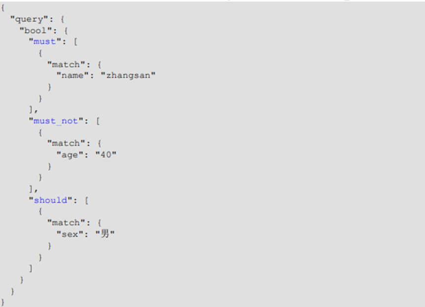
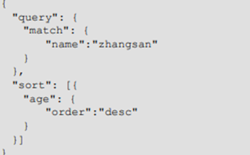
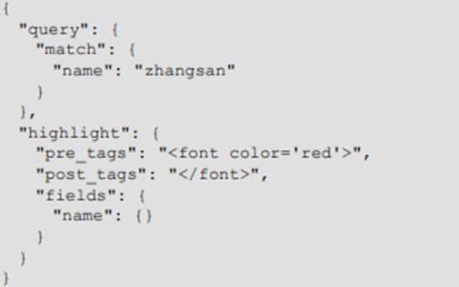
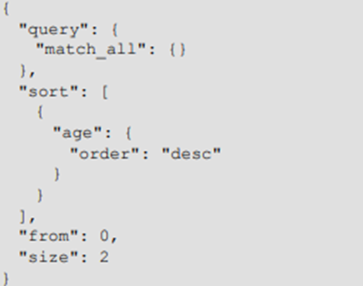
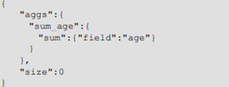
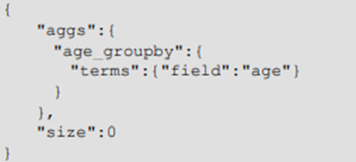
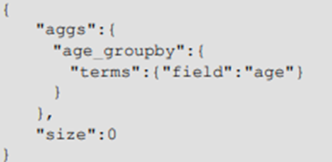

# ubuntu安装elasticsearch

https://www.myfreax.com/how-to-install-elasticsearch-on-ubuntu-18-04/

# 倒排索引

id	text

--------------

1001	my name is zhang san

1002	my name is li si


mysql数据库进行查询时可以使用主键(id)  建立索引查，或者查询字段  like 模糊查询，但是模糊查询速度比较慢，并且大小写问题如何解决是个问题

倒排索引使用如下方式：

name:1001,1002

zhang san:1001

**这里弱化了表的概念，以短文本  关键字为索引，关联id**


# 索引操作(等同于数据库)

## 创建索引

发送put请求：

localhost:9200/shopping 创建索引  

## 查看索引

发送get请求

localhost:9200/_cat/indices?v  查看所有索引

localhost:9200/shopping  查看shopping索引

## 删除索引

发送delete请求

localhost:9200/shopping  

 

# 文档操作(数据item)

## 创建文档：:_doc

发送post请求

```java
127.0.0.1:9200/shopping/_doc      //_doc表示文档
```


但是这里没有内容，需要加请求体body

```xml
{
	 “name”:”sz”,
	 “sex”:”man”,
     “age”:26
}
```

## 自定义id

默认随机生成id

```java
127.0.0.1:9200/shopping/_doc/1001  
```


 

## 根据id查看文档:get请求

Get请求

```java
127.0.0.1:9200/shopping/_doc/1001
```


## 修改文档:_update

可以发送原请求（带上id）新的body将会覆盖原数据

或者

```java
127.0.0.1:9200/shopping/_update/1001
```


```java
{
    “doc”:{     //修改什么类型数据
        “age:30”//修改的数据
    }
}
```


## 删除文档:delete 请求

发送delete请求

```java
127.0.0.1:9200/shopping/_doc/1001
```


 

## 条件删除文档:query match

POST 请求 ：http://127.0.0.1:9200/shopping/_delete_by_query

```java
{
     “query”:{
         “match”:{
        	 “name”:”sz”
		  }
	 }
}
```

# 创建映射:_mapping

向 ES 服务器发 **PUT** 请求 ：

http://127.0.0.1:9200/student/_mapping

```xml
{
	"properties":{
		"name":{//key   
			"type": "text",//数据类型   
			"index": true //是否支持索引  
		},
		"sex":{//key
			"type": "text", //数据类型  
			"index": false//是否支持索引   
		},
		"age":{ //key  
			"type": "long",
			"index": false
		}
	}
}  
```


 

## 常用type：

- String 类型，又分两种：

  - text：可分词

  - keyword：不可分词，数据会作为完整字段进行匹配

- Numerical：数值类型，分两类 

  - 基本数据类型：long、integer、short、byte、double、float、half_float 

  - 浮点数的高精度类型：scaled_float

Date：日期类型 

Array：数组类型 

Object：对象 

index：是否索引，默认为 true，也就是说你不进行任何配置，所有字段都会被索引。

- true：字段会被索引，则可以用来进行搜索 
- false：字段不会被索引，不能用来搜索

# 高级查询

## 查询文档:query

发 GET 请求 ：http://127.0.0.1:9200/student/_search  //_search代表查询请求？

```xml
{
	“query”:{//这是个查询对象
		“match_all”:{//查询所有
		}
	}
}
```


## 匹配查询:match

Match会把查询条件进行分词，然后进行查询，多个词条之间是 or 的关系

```xml
"query": { 
	"match": { 
		"name":"zhangsan" 
	}
}
```


 

## 关键字精确查询:term

term精确的关键词匹配查询，不对查询条件进行分词。

```xml
{
	"query": { 
		"term": { 
			"name": { 
				"value": "zhangsan"
 			}
		 }
	}
}
```


## 多关键字精确查询:terms

terms 查询和 term 查询一样，但它允许你指定多值进行匹配。 如果这个字段包含了指定值中的任何一个值，那么这个文档满足条件，**类似于 mysql 的 in**

```xml
{ 
	"query": {
		 "terms": {
 			"name": ["zhangsan","lisi"] 
		 }
	}
}
```


## 指定查询字段:_source

相当于select x,y,z from…

会把文档中保存在_source 的所有字段都返回。 

如果我们只想获取其中的部分字段，我们可以添加_source 的过滤

```xml
{ 
	"_source": ["name","nickname"], 
	"query": { 
		"terms": { 
			"nickname": ["zhangsan"] 
		}
	}
}
```


## 过滤字段：_source-includes-excludes

```xml
{ 
	"_source": { 
		"includes": ["name","nickname"] 
	}, 
	"query": { 
		"terms": { 
			"nickname": ["zhangsan"] 
		 }
	}
}
```


## 组合查询:bool

`bool`把各种其它查询通过`must`（必须 ）、`must_not`（必须不）、`should`（应该）的方 式进行组合



## 范围查询:range


## 模糊查询：fuzzy

Fuzziness可以指定**编辑距离**


## 单多字段排序：“sort”:[{先},{后}]



## 高亮查询:highlight

- pre_tags：前置标签 
-  post_tags：后置标签 
- fields：需要高亮的字段
- title：这里声明 title 字段需要高亮，后面可以为这个字段设置特有配置，也可以空



## 分页查询：from size



 

## 聚合查询:aggs 没有query



 

## 分组查询，分组聚合:terms,aggs



 

 

 

 

 Accounted   是否处理字段

#  Java操作ElasticSearch

# 索引操作

## 创建客户端

```java
RestHighLevelClient client = new RestHighLevelClient(RestClient.builder(new HttpHost("192.168.222.132", 9200, "http")));
```

## 创建索引

```java
public  void createIndex() throws IOException {
    RestHighLevelClient client = getClient();
    //请求对象
    CreateIndexRequest request = new CreateIndexRequest("user");
    //发送请求 返回响应
    CreateIndexResponse response = client.indices().create(request, RequestOptions.DEFAULT);
    System.out.println("操作状态"+response.isAcknowledged());
}
```

## 查看索引

```java
public void getIndex() throws IOException {
    RestHighLevelClient client = getClient();
    GetIndexRequest request = new GetIndexRequest("user");
    GetIndexResponse response = client.indices().get(request, RequestOptions.DEFAULT);
    System.out.println("mappings"+response.getMappings());
    System.out.println("aliases"+response.getAliases());
}
```


## 删除索引

```java
public void deleteIndex() throws IOException {
    RestHighLevelClient client = getClient();
    DeleteIndexRequest request = new DeleteIndexRequest("user");
    AcknowledgedResponse response = client.indices().delete(request, RequestOptions.DEFAULT);
    System.out.println("删除索引"+request.toString());
}
```


# 文档操作

## 新增文档

```java
public void index() throws IOException {
    RestHighLevelClient client = getClient();
    // 新增文档 - 请求对象
    IndexRequest request = new IndexRequest();
    // 设置索引及唯一性标识
    request.index("user").id("1001");
    User user = new User("sz", 123, "man");
    //将属性映射成字符串
    ObjectMapper objectMapper = new ObjectMapper();
    String s = objectMapper.writeValueAsString(user);
    System.out.println("映射结果"+s);//{"name":"sz","age":123,"sex":"man"}
    // 添加文档数据，数据格式为 JSON 格式
    request.source(s, XContentType.JSON);
    // 客户端发送请求，获取响应对象
    IndexResponse response = client.index(request, RequestOptions.DEFAULT);
    System.out.println("_index:" + response.getIndex());
    System.out.println("_id:" + response.getId());
    System.out.println("_result:" + response.getResult());
}
```


## 修改文档

```java
public void update() throws IOException {
    RestHighLevelClient client = getClient();
    UpdateRequest updateRequest = new UpdateRequest();
    updateRequest.index("user").id("1001");
    updateRequest.doc(XContentType.JSON,"age",999);
    UpdateResponse updateResponse = client.update(updateRequest, RequestOptions.DEFAULT);
    System.out.println("_index:" + updateResponse.getIndex());
    System.out.println("_id:" + updateResponse.getId());
    System.out.println("_result:" + updateResponse.getResult());
}
```


## 查询文档

```java
public void get() throws IOException {
    RestHighLevelClient client = getClient();
    //1.创建请求对象
    GetRequest request = new GetRequest().index("user").id("1001");
    //2.客户端发送请求，获取响应对象
    GetResponse response = client.get(request, RequestOptions.DEFAULT);
    System.out.println("_index:" + response.getIndex());
    System.out.println("_type:" + response.getType());
    System.out.println("_id:" + response.getId());
    System.out.println("source:" + response.getSourceAsString());//{"name":"sz","age":999,"sex":"man"}
}
```


## 删除文档

```java
//创建请求对象
DeleteRequest request = new DeleteRequest().index("user").id("1");
//客户端发送请求，获取响应对象
DeleteResponse response = client.delete(request, RequestOptions.DEFAULT);
//打印信息
System.out.println(response.toString());
```


# 批量操作

## 批量新增

```java
public void bulkAddRequest() throws IOException {
    RestHighLevelClient client = getClient();
    BulkRequest bulkRequest1 = new BulkRequest();
    bulkRequest1.add(new IndexRequest().index("user").id("1001").source(XContentType.JSON,"name","小明","age","123"));
    bulkRequest1.add(new IndexRequest().index("user").id("1002").source(XContentType.JSON,"name","小花","age","121"));
    bulkRequest1.add(new IndexRequest().index("user").id("1003").source(XContentType.JSON,"name","小黑","age","124"));
    BulkResponse responses = client.bulk(bulkRequest1, RequestOptions.DEFAULT);
    System.out.println("took:" + responses.getTook());
    System.out.println("items:" + responses.getItems());
}
```


## 批量删除

```java
public void bulkDeleteRequest() throws IOException {
    RestHighLevelClient client = getClient();
    BulkRequest bulkRequest1 = new BulkRequest();
    bulkRequest1.add(new DeleteRequest().index("user").id("1003"));
    BulkResponse responses = client.bulk(bulkRequest1, RequestOptions.DEFAULT);
    System.out.println("took:" + responses.getTook());
    System.out.println("items:" + responses.getItems());
}
```


# 高级查询

## 请求体查询

```java
//查询所有索引数据
public void matchAllQuery() throws IOException {
    RestHighLevelClient client  = getClient();
    // 创建搜索请求对象
    SearchRequest searchRequest = new SearchRequest();
    searchRequest.indices("user");
    SearchSourceBuilder searchSourceBuilder = new SearchSourceBuilder();
    searchSourceBuilder.query(QueryBuilders.matchAllQuery());
    searchRequest.source(searchSourceBuilder);
    SearchResponse response = client.search(searchRequest,RequestOptions.DEFAULT);
    // 查询匹配
    SearchHits hits = response.getHits();
    System.out.println("hits========>>");
    for (SearchHit hit : hits) {
        //输出每条查询的结果信息
        System.out.println(hit.getSourceAsString());
    }
    System.out.println("<<========");
}
```


## term 查询，查询条件为关键字

```java
// 创建搜索请求对象
SearchRequest request = new SearchRequest();
request.indices("student");
// 构建查询的请求体
SearchSourceBuilder sourceBuilder = new SearchSourceBuilder();
sourceBuilder.query(QueryBuilders.termQuery("age", "30"));
request.source(sourceBuilder);
SearchResponse response = client.search(request, RequestOptions.DEFAULT);
// 查询匹配
SearchHits hits = response.getHits();
System.out.println("took:" + response.getTook());
System.out.println("timeout:" + response.isTimedOut());
System.out.println("total:" + hits.getTotalHits());
System.out.println("MaxScore:" + hits.getMaxScore());
System.out.println("hits========>>");
for (SearchHit hit : hits) {
    //输出每条查询的结果信息
    System.out.println(hit.getSourceAsString());
}
System.out.println("<<========");
```


## 分页查询

```java
// 创建搜索请求对象
SearchRequest request = new SearchRequest();
request.indices("student");
// 构建查询的请求体
SearchSourceBuilder sourceBuilder = new SearchSourceBuilder();
sourceBuilder.query(QueryBuilders.matchAllQuery());
// 分页查询
// 当前页其实索引(第一条数据的顺序号)，from
sourceBuilder.from(0);
// 每页显示多少条 size
sourceBuilder.size(2);
request.source(sourceBuilder);
SearchResponse response = client.search(request, RequestOptions.DEFAULT);
// 查询匹配
SearchHits hits = response.getHits();
System.out.println("took:" + response.getTook());
System.out.println("timeout:" + response.isTimedOut());
System.out.println("total:" + hits.getTotalHits());
System.out.println("MaxScore:" + hits.getMaxScore());
System.out.println("hits========>>");
for (SearchHit hit : hits) {
    //输出每条查询的结果信息
    System.out.println(hit.getSourceAsString());
}
System.out.println("<<========");
```


## 数据排序

```java
// 构建查询的请求体
SearchSourceBuilder sourceBuilder = new SearchSourceBuilder();
sourceBuilder.query(QueryBuilders.matchAllQuery());
// 排序
sourceBuilder.sort("age", SortOrder.ASC);
request.source(sourceBuilder);
SearchResponse response = client.search(request, RequestOptions.DEFAULT);
// 查询匹配
SearchHits hits = response.getHits();
```


## 过滤字段

```java
// 创建搜索请求对象
SearchRequest request = new SearchRequest();
request.indices("student");
// 构建查询的请求体
SearchSourceBuilder sourceBuilder = new SearchSourceBuilder();
sourceBuilder.query(QueryBuilders.matchAllQuery());
//查询字段过滤
String[] excludes = {};
String[] includes = {"name", "age"};
sourceBuilder.fetchSource(includes, excludes);
request.source(sourceBuilder);
SearchResponse response = client.search(request, RequestOptions.DEFAULT);
```


## Bool 查询

```java
// 创建搜索请求对象
SearchRequest request = new SearchRequest();
request.indices("student");
// 构建查询的请求体
SearchSourceBuilder sourceBuilder = new SearchSourceBuilder();
BoolQueryBuilder boolQueryBuilder = QueryBuilders.boolQuery();
// 必须包含
boolQueryBuilder.must(QueryBuilders.matchQuery("age", "30"));
// 一定不含
boolQueryBuilder.mustNot(QueryBuilders.matchQuery("name", "zhangsan"));
// 可能包含
boolQueryBuilder.should(QueryBuilders.matchQuery("sex", "男"));
sourceBuilder.query(boolQueryBuilder);
request.source(sourceBuilder);
SearchResponse response = client.search(request, RequestOptions.DEFAULT);
// 查询匹配
SearchHits hits = response.getHits();
```


## 范围查询

```java
// 创建搜索请求对象
SearchRequest request = new SearchRequest();
request.indices("student");
// 构建查询的请求体
SearchSourceBuilder sourceBuilder = new SearchSourceBuilder();
RangeQueryBuilder rangeQuery = QueryBuilders.rangeQuery("age");
// 大于等于
rangeQuery.gte("30");
// 小于等于
rangeQuery.lte("40");
sourceBuilder.query(rangeQuery);
request.source(sourceBuilder);
SearchResponse response = client.search(request, RequestOptions.DEFAULT);
// 查询匹配
SearchHits hits = response.getHits();
```


## 模糊查询

```java
// 创建搜索请求对象
SearchRequest request = new SearchRequest();
request.indices("student");
// 构建查询的请求体
SearchSourceBuilder sourceBuilder = new SearchSourceBuilder();
sourceBuilder.query(QueryBuilders.fuzzyQuery("name","zhangsan").fuzziness(Fu
zziness.ONE));
request.source(sourceBuilder);
SearchResponse response = client.search(request, RequestOptions.DEFAULT);
// 查询匹配
SearchHits hits = response.getHits();
```


## 高亮查询

```java
// 高亮查询
SearchRequest request = new SearchRequest().indices("student");
//2.创建查询请求体构建器
SearchSourceBuilder sourceBuilder = new SearchSourceBuilder();
//构建查询方式：高亮查询
TermsQueryBuilder termsQueryBuilder = 
QueryBuilders.termsQuery("name","zhangsan");
//设置查询方式
sourceBuilder.query(termsQueryBuilder);
//构建高亮字段
HighlightBuilder highlightBuilder = new HighlightBuilder();
highlightBuilder.preTags("<font color='red'>");//设置标签前缀
highlightBuilder.postTags("</font>");//设置标签后缀
highlightBuilder.field("name");//设置高亮字段
//设置高亮构建对象
sourceBuilder.highlighter(highlightBuilder);
//设置请求体
request.source(sourceBuilder);
//3.客户端发送请求，获取响应对象
SearchResponse response = client.search(request, RequestOptions.DEFAULT);
//4.打印响应结果
SearchHits hits = response.getHits();
```


## 聚合查询

```java
// 高亮查询
SearchRequest request = new SearchRequest().indices("student");
SearchSourceBuilder sourceBuilder = new SearchSourceBuilder();
sourceBuilder.aggregation(AggregationBuilders.max("maxAge").field("age"));
//设置请求体
request.source(sourceBuilder);
//3.客户端发送请求，获取响应对象
SearchResponse response = client.search(request, RequestOptions.DEFAULT);
//4.打印响应结果
SearchHits hits = response.getHits();
System.out.println(response);
```


## 分组统计

 ```java
 // 高亮查询
 SearchRequest request = new SearchRequest().indices("student");
 SearchSourceBuilder sourceBuilder = new SearchSourceBuilder();
 sourceBuilder.aggregation(AggregationBuilders.terms("age_groupby").field("ag
 e"));
 //设置请求体
 request.source(sourceBuilder);
 //3.客户端发送请求，获取响应对象
 SearchResponse response = client.search(request, RequestOptions.DEFAULT);
 ```


 

 

 

 

 

 

 


 

 

 

 

 

 