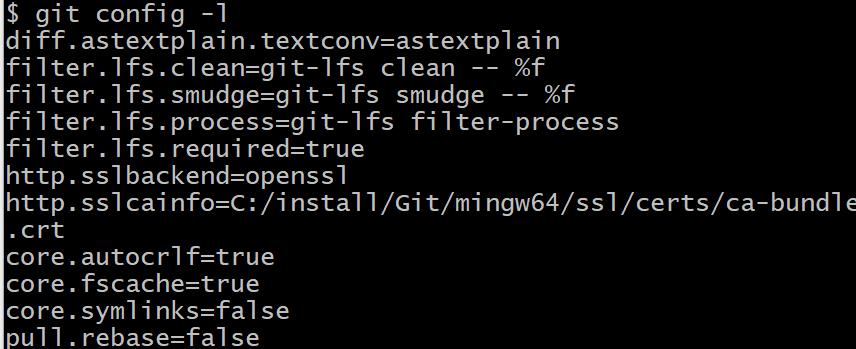
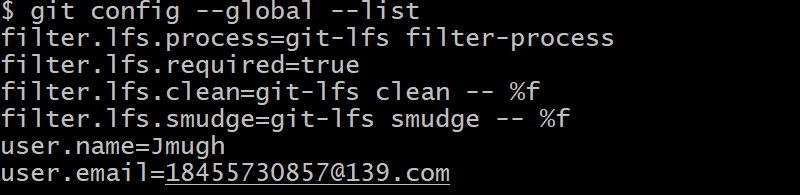
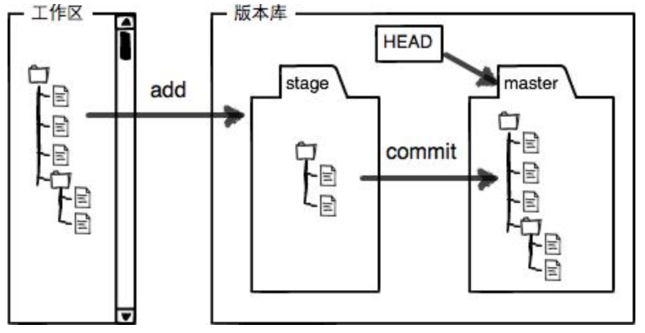

## git配置

#### 查看配置：git config -l 



#### 查看用户配置： git config --global --list



#### 设置全局个人信息

**git config --global user.name "Jmugh"**

**git config --global user.email "18455730857@139.com"**

**<u>这些属性  会在C:\Users\Administrator\\.gitconfig中</u>**


#### push  没有权限

```java
git push
fatal: The current branch sunzhong has no upstream branch.
To push the current branch and set the remote as upstream, use

git push --set-upstream origin sunzhong
To have this happen automatically for branches without a tracking
upstream, see 'push.autoSetupRemote' in 'git help config'.
```


## 常用命令

### 提交

```mysql
git add . //将工作区（本地能看到的）加入暂存区  staged， 
git commit -m "xxx"  //提交数据到本地仓库
git status //查看仓库状态，当全部加入到本地仓库之后（commit），会显示 work tree clean
			//如果有修改，不管是有没有add到暂存区， 都会提示modified的文件
			//如果是新创建的，不是修改的，那么会显示是untracked的  未被跟踪的文件，需要使用git add . 追踪文件
git diff filename //查看更新的内容
git log // 查看每次提交的日志
```

### 版本回退

```msyql
git reset --hard HEAD^  // 回到上一个版本
git reset --hard cimmit_id  //回到指定版本
git reflog // 查看每次提交日志  可以看到commit id,
```


### 工作区和暂存区



### 撤销修改

#### 撤销add之前的修改：工作区

```mysql
git checkout -- readme.txt
```

命令`git checkout -- readme.txt`意思就是，把`readme.txt`文件在工作区的修改全部撤销，这里有两种情况：

- 一种是`readme.txt`自修改后还没有被放到暂存区，现在，撤销修改就回到和版本库一模一样的状态；

- 一种是`readme.txt`已经添加到暂存区后，又作了修改，现在，撤销修改就回到添加到暂存区后的状态。

总之，就是让这个文件回到最近一次`git commit`或`git add`时的状态。


#### 撤销add之后，commit之前的修改：暂存区(撤回到工作区，清空暂存区)

```msyql
git reset HEAD readme.txt   //真正放弃工作区的修改  继续使用git checkout --readme.txt
```

### 关联远程分支

```mysql
git remote add origin git@github.com:michaelliao/learngit.git
git remote -v
git remote rm origin
```


