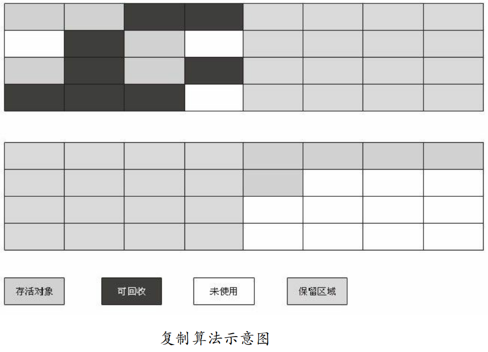
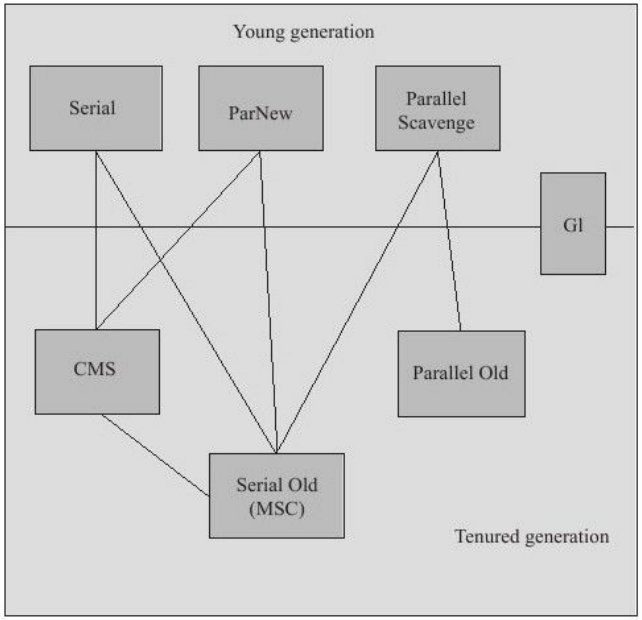

# JVM

## 内存区域

## 

#### 程序计数器

​		字节码解释器工作时就是通过改变这个计数器的值来选取下一条需要执行的字节码指令，分支、循环、跳转、异常处理、线程恢复等基础功能都需要依赖这个计数器来完成。 为了线程切换后能恢复到正确的执行位置，每条线程都需要有一个独立的程序计数器，各条线程之间计数器互不影响，独立存储，我们称这类内存区域为“线程私有”的内存。 

- 如果线程正在执行的是一个Java方法，这个计数器记录的是正在执行的虚拟机字节码指令的地址；

- 如果正在执行的是Native方法，这个计数器值则为空（Undefined）。

  此内存区域是唯一一个在Java虚拟机规范中没有规定任何OutOfMemoryError情况的区域。

 

#### Java虚拟机栈

​		每个方法在执行的同时都会创建一个栈帧（Stack Frame[1]）用于存储局部变量表、操作数栈、动态链接、方法出口等信息。每一个方法从调用直至执行完成的过程，就对应着一个栈帧在虚拟机栈中入栈到出栈的过程。 

#### 本地方法栈 

​		本地方法栈（Native Method Stack）与虚拟机栈所发挥的作用是非常相似的，它们之间的区别不过是虚拟机栈为虚拟机执行Java方法（也就是字节码）服务，而本地方法栈则为虚拟机使用到的Native方法服务。

#### Java堆

​		Java堆是被所有线程共享的一块内存区域，在虚拟机启动时创建。此内存区域的唯一目的就是存放对象实例，几乎所有的对象实例都在这里分配内存。

#### 方法区

​		方法区（Method Area）与Java堆一样，是各个线程共享的内存区域，它用于存储已被虚拟机加载的类信息、常量、静态变量、即时编译器编译后的代码等数据。

​		虽然Java虚拟机规范把方法区描述为堆的一个逻辑部分，但是它却有一个别名叫做Non-Heap（非堆），目的应该是与Java堆区分开来。 

#### 运行时常量池

​		运行时常量池（Runtime Constant Pool）是方法区的一部分。Class文件中除了有类的版本、字段、方法、接口等描述信息外，还有一项信息是常量池Constant Pool Table），用于存放编译期生成的各种字面量和符号引用，这部分内容将在类加载后进入方法区的运行时常量池中存放。

 

#### 直接内存

​		直接内存（Direct Memory）并不是虚拟机运行时数据区的一部分，也不是Java虚拟机规范中定义的内存区域。

## 对象的创建

- **new**:虚拟机遇到一条new指令时，首先将去检查这个指令的参数是否能在常量池中定位到一个类的符号引用，并且检查这个符号引用代表的类是否已被加载、解析和初始化过。如果没有，那必须先执行相应的类加载过程。
- **分配内存**:对象所需内存的大小在类加载完成后便可完全确定（如何确定将在2.3.2节中介绍），为对象分配空间的任务等同 于把一块确定大小的内存从Java堆中划分出来。
- **初始化为零值**:这一步操作保证了对象的实例字段在Java代码中可以不赋初始值就直接使用，程序能访问到这些字段的数据类型所对应的零值。 
- **设置对象头**：然后虚拟机要对对象进行必要的设置，例如这个对象是哪个类的实例、如何才能找到类的元数据信息、对象的哈希码、对象的GC分代年龄等信息。这些信息存放在对象的对象头（Object Header）之中。根据虚拟机当前的运行状态的不同，如是否启用偏向锁等，对象头会有不同的设置方式。
- **执行init方法**：把对象按照程序员的意愿进行初始化，这样一个真正可用的对象才算完全产生出来。 

## 对象的访问

### 句柄方式


### 指针方式


## 对象的内存布局 

**对象**在内存中存储的布局可以分为3块区域：对象头（Header）、实例数据（Instance Data）和对齐填充（Padding）。

#### 对象头

synchronized用的锁是存在Java对象头里的。如果对象是数组类型，则虚拟机用3个字宽（Word）存储对象头，如果对象是非数组类型，则用2字宽存储对象头。在32位虚拟机中，1字宽等于4字节，即32bit。


Java对象头里的**Mark Word**里默认存储对象的HashCode、分代年龄和锁标记位。


## 垃圾回收与内存分配

#### 哪些内存需要回收？

**程序计数器、虚拟机栈、本地方法栈3个区域随线程而生，随线程而灭**；栈中的栈帧随着方法的进入和退出而有条不紊地执行着出栈和入栈操作。每一个栈帧中分配多少内存基本上是在类结构确定下来时就已知的，因此这几个区域的内存分配和回收都具备确定性，在这几个区域内就不需要过多考虑回收的问题，因为方法结束或者线程结束时，内存自然就跟随着回收了。

而**Java堆和方法区则不一样**，一个接口中的多个实现类需要的内存可能不一样，一个方法中的多个分支需要的内存也可能不一样，我们只有在程序处于运行期间时才能知道会创建哪些对象，这部分内存的分配和回收都是动态的，垃圾收集器所关注的是这部分内存，后续讨论中的“内存”分配与回收也仅指这一部分内存。

#### 对象已死吗 ？

**引用计数算法** 

给对象中添加一个引用计数器，每当有一个地方引用它时，计数器值就加1；当引用失效时，计数器值就减1；任何时刻计数器为0的对象就是不可能再被使用的。

优点：引用计数算法（Reference Counting）的实现简单，判定效率也很高。

缺点：很难解决对象之间相互循环引用的问题。

对象objA和objB都有字段instance，赋值令objA.instance=objB及objB.instance=objA，除此之外，这两个对象再无任何引用，实际上这两个对象已经不可能再被访问，但是它们因为互相引用着对方，导致它们的引用计数都不为0，于是引用计数算法无法通知GC收集器回收它们。

```java
/**
 * testGC()方法执行后，objA和objB会不会被GC呢？
 */
public class ReferenceCountingGC {
    public Object instance = null;
    private static final int _1MB=1024*1024;
    /**
     * 这个成员属性的唯一意义就是占点内存，以便能在GC日志中看清楚是否被回收过
     */
    private byte[] bigSize = new byte[2 * _1MB];
    public static void testGC() {
        ReferenceCountingGC objA = new ReferenceCountingGC();
        ReferenceCountingGC objB = new ReferenceCountingGC();
        objA.instance = objB;
        objB.instance = objA;
        objA = null;
        objB = null; //假设在这行发生GC,objA和objB是否能被回收？
        System.gc();
    }
    public static void main(String[] args) {
        new ReferenceCountingGC().testGC();
    }
}
```


**可达性分析算法**

是通过一系列的称为"GC Roots"的对象作为起始点，从这些节点开始向下搜索，搜索所走过的路径称为引用链（Reference Chain），当一个对象到GC Roots没有任何引用链相连（用图论的话来说，就是从GC Roots到这个对象不可达）时，则证明此对象是不可用的。

</img>


可作为GC Roots的对象包括下面几种:

- 虚拟机栈（栈帧中的本地变量表）中引用的对象。 

- 方法区中类静态属性引用的对象。 

- 方法区中常量引用的对象。 

- 本地方法栈中JNI（即一般说的Native方法）引用的对象

## 强软弱虚引用

- **强引用**：类似"Object obj=new Object()"这类的引用，只要强引用还存在，垃圾收集器永远不会回收掉被引用的对象。
- **软引用**：软引用是用来描述一些还有用但并非必需的对象。对于软引用关联着的对象，在系统 将要发生内存溢出异常之前，将会把这些对象列进回收范围之中进行第二次回收。如果这次回收还没有足够的内存，才会抛出内存溢出异常。在JDK 1.2之后，提供了SoftReference类来实现软引用。
- **弱引用**：弱引用也是用来描述非必需对象的，但是它的强度比软引用更弱一些，被弱引用关联的对象只能生存到下一次垃圾收集发生之前。当垃圾收集器工作时，无论当前内存是否足够，都会回收掉只被弱引用关联的对象。在JDK 1.2之后，提供了WeakReference类来实现弱引用。
- **虚引用**：它是最弱的一种引用关系。一个对象是否有虚引用的存在，完全不会对其生存时间构成影响，也无法通过虚引用来取得一个对象实例。 为一个对象设置虚引用关联的唯一目的就是能在这个对象被收集器回收时收到一个系统通知。PhantomReference类来实现虚引用。


## 生存还是死亡

​	<font color="red">**即使在可达性分析算法中不可达的对象，也并非是“非死不可”的，要真正宣告一个对象死亡，至少要经历两次标记过程：**</font>

1.如果对象在进行可达性分析后发现没有与GC Roots相连接的引用链，那它将会被第一次标记并且进行一次筛选，筛选的条件是此对象是否有必要执行finalize()方法。当对象没有覆盖finalize()方法，或者finalize()方法已经被虚拟机调用过，虚拟机将这两种情况都视为“没有必要执行”。 

2.如果这个对象被判定为有必要执行finalize()方法，那么这个对象将会放置在一个叫做F-Queue的队列之中，并在稍后由一个由虚拟机自动建立的、低优先级的Finalizer线程去执行它。这里所谓的“执行”是指虚拟机会触发这个方法，但并不承诺会等待它运行结束，这样做的原因是，如果一个对象在finalize()方法中执行缓慢，或者发生了死循环（更极端的情况），将很可能会导致F-Queue队列中其他对象永久处于等待，甚至导致整个内存回收系统崩溃。finalize()方法是对象逃脱死亡命运的最后一次机会，稍后GC将对F-Queue中的对象进行第二次小规模的标记，如果对象要在finalize()中成功拯救自己——只要重新与引用链上的任何一个对象建立关联即可，譬如把自己（this关键字）赋值给某个类变量或者对象的成员变量，那在第二次标记时它将被移除出“即将回收”的集合；如果对象这时候还没有逃脱，那基本上它就真的被回收了。

**演示自我拯救**

```java
/**
 * 此代码演示了两点： 
 *1.对象可以在被GC时自我拯救。 
 *2.这种自救的机会只有一次，因为一个对象的finalize()方法最多只会被系统自动调用一次
 */
public class FinalizeEscapeGC {
    public static FinalizeEscapeGC SAVE_HOOK = null;
    public void isAlive() {
        System.out.println("yes,i am still alive:");}
    @Override
    protected void finalize() throws Throwable {
        super.finalize();
        System.out.println("finalize mehtod executed!");
        FinalizeEscapeGC.SAVE_HOOK = this;
    }
    public static void main(String[] args)throws Throwable {
        SAVE_HOOK = new FinalizeEscapeGC();
        //对象第一次成功拯救自己
        SAVE_HOOK=null;
        System.gc(); //因为finalize方法优先级很低，所以暂停0.5秒以等待它
        Thread.sleep(500);
        if(SAVE_HOOK!=null){
            SAVE_HOOK.isAlive();
        }else{
            System.out.println("no,i am dead:");
        }
        //下面这段代码与上面的完全相同，但是这次自救却失败了
        SAVE_HOOK=null;
        System.gc(); //因为finalize方法优先级很低，所以暂停0.5秒以等待它
        Thread.sleep(500);
        if(SAVE_HOOK!=null){
            SAVE_HOOK.isAlive();
        }else{
            System.out.println("no,i am dead:");
        }
    }
}
```

## 回收方法区 

方法区（或者HotSpot虚拟机中的永久代）进行垃圾收集的“性价比”一般比较低，永久代的垃圾收集主要回收两部分内容：废弃常量和无用的类。

**回收常量**：回收废弃常量与回收Java堆中的对象非常类似。假如一个字符串"abc"已经进入了常量池中，但是当前系统没有任何一个String对象是叫做"abc"的，换句话说，就是没有任何String对象引用常量池中的"abc"常量，也没有其他地方引用了这个字面量，如果这时发生内存回收，而且必要的话，这个"abc"常量就会被系统清理出常量池。常量池中的其他类（接口）、方法、字段的符号引用也与此类似。

**回收类**：类需要同时满足下面3个条件才能算是“无用的类”：

- 该类所有的实例都已经被回收，也就是Java堆中不存在该类的任何实例。 

- 加载该类的ClassLoader已经被回收。 

- 该类对应的java.lang.Class对象没有在任何地方被引用，无法在任何地方通过反射访问该类的方法。

## 垃圾收集算法 

#### 标记-清除算法 

​		最基础的收集算法是“标记-清除”（Mark-Sweep）算法，如同它的名字一样，算法分为“标记”和“清除”两个阶段：

​		首先标记出所有需要回收的对象，在标记完成后统一回收所有被标记的对象，它的标记过程其实在前一节讲述对象标记判定时已经介绍过了。之所以 说它是最基础的收集算法，是因为后续的收集算法都是基于这种思路并对其不足进行改进而得到的。

它的主要不足有两个：

- 一个是效率问题，标记和清除两个过程的效率都不高；
- 另一个是空间问题，标记清除之后会产生大量不连续的内存碎片，空间碎片太多可能会导致以后在程序运行过程中需要分配较大对象时，无法找到足够的连续内存而不得不提前触发另一次垃圾收集动作。

</img>

#### 复制算法

​		为了解决效率问题，一种称为“复制”（Copying）的收集算法出现了，它将可用内存按容量划分为大小相等的两块，每次只使用其中的一块。当这一块的内存用完了，就将还存活着的对象复制到另外一块上面，然后再把已使用过的内存空间一次清理掉。

优点：这样使得每次都是对整个半区进行内存回收，内存分配时也就不用考虑内存碎片等复杂情况，只要移动堆顶指针，按顺序分配内存即可，实现简单，运行高效。

缺点：只是这种算法的代价是将内存缩小为了原来的一半，未免太高了一点。实际是分配8:1:1

</img>

#### 标记-整理算法

​		复制收集算法在对象存活率较高时就要进行较多的复制操作，效率将会变低。更关键 的是，如果不想浪费50%的空间，就需要有额外的空间进行分配担保，以应对被使用的内存中所有对象都100%存活的极端情况，所以在老年代一般不能直接选用这种算法。 

根据老年代的特点，有人提出了另外一种“标记-整理”（Mark-Compact）算法，标记过程仍然与“标记-清除”算法一样，但后续步骤不是直接对可回收对象进行清理，而是让所有存活的对象都向一端移动，然后直接清理掉端边界以外的内存。

</img>

#### 分代收集算法 

​		**当前商业虚拟机的垃圾收集都采用“分代收集”（Generational Collection）算法**，这种算法并没有什么新的思想，只是根据对象存活周期的不同将内存划分为几块。一般是把Java堆分为新生代和老年代，这样就可以根据各个年代的特点采用最适当的收集算法。

- 在新生代中，每次垃圾收集时都发现有大批对象死去，只有少量存活，那就选用复制算法，只需要付出少量存活对象的复制成本就可以完成收集。
- 而老年代中因为对象存活率高、没有额外空间对它进行分配担保，就必须使用“标记—清理”或者“标记—整理”算法来进行回收。


## 垃圾收集器

</img>

#### Serial收集器 

**特点：**

- 单线程
- 垃圾收集时必须暂停其他所有的工作线程
- 新生代
- 采用复制算法


</img>

#### ParNew收集器 

​		**ParNew收集器其实就是Serial收集器的多线程版本**，除了使用多条线程进行垃圾收集 之外，其余行为包括Serial收集器可用的所有<u>控制参数</u>、<u>收集算法</u>、<u>Stop TheWorld</u>、<u>对象分配规则</u>、<u>回收策略</u>等都与Serial收集器完全一样

**特点：**

- 多线程
- 垃圾收集时必须暂停其他所有的工作线程
- 新生代
- 采用复制算法

</img>

#### Parallel Scavenge收集器

**Parallel Scavenge与其他收集器不同：**

- CMS等收集器的关注点是尽可能地缩短垃圾收集时用户线程的停顿时间。
-  Parallel Scavenge收集器的目标则是达到一个可控制的吞吐量（Throughput）。

**特点：**

- 多线程
- 新生代使用复制算法
- 垃圾收集时暂停其他所有工作线程

吞吐量=运行用户代码时间/（运行用户代码时间+垃圾 收集时间）

#### Serial Old收集器

Serial Old是Serial收集器的老年代版本。

**特点：**

- 老年代收集器
- 单线程
- 标记-整理算法


#### Parallel Old收集器

Parallel Old是Parallel Scavenge收集器的老年代版本。

特点：

- 老年代收集器
- 多线程
- 标记-整理算法
- </img>

#### CMS收集器

CMS（Concurrent Mark Sweep）收集器是一种以获取最短回收停顿时间为目标的收集器。（mark sweep 标记清除算法）

**运行过程分为4个步骤:**

1. 初始标记（CMS initial mark）; 需要"Stop The World",初始标记仅仅只是标记一下GC Roots能直接关联到的对象，速度很快。

2. 并发标记（CMS concurrent mark）；并发标记阶段就是进行GC Roots Tracing的过程。

3. 重新标记（CMS remark） ;需要"Stop The World"，重新标记阶段则是为了修正并发标记期间因用户程序继续运作而导致标记产生变动的那一部分对象的标记记录，这个阶段的停顿时间一般会比初始标记阶 段稍长一些，但远比并发标记的时间短。

4. 并发清除（CMS concurrent sweep） 

由于整个过程中耗时最长的并发标记和并发清除过程收集器线程都可以与用户线程一 起工作，所以，从总体上来说，CMS收集器的内存回收过程是与用户线程一起并发执行的。

</img>

缺点：

- 在并发阶段，它虽然不会导致用户线程停顿，但是会因为占用了一部分线程（或者说CPU资源）而导致应用程序变慢，总吞吐量会降低。
- CMS收集器无法处理浮动垃圾（Floating Garbage）。由于CMS并发清理阶段用户线程还在运行着， 伴随程序运行自然就还会有新的垃圾不断产生，这一部分垃圾出现在标记过程之后，CMS无法在当次收集中处理掉它们，只好留待下一次GC时再清理掉。这一部分垃圾就称 为“浮动垃圾”。
- 基于“标记—清除”算法实现的收集器，会有大量空间碎片产生。

#### G1收集器

​		G1（Garbage-First）收集器是当今收集器技术发展的最前沿成果之一。

[G1收集器博客详解]: https://www.cnblogs.com/GrimMjx/p/12234564.html


**特点：**

- 并行与并发

- 分代收集：保留分代概念
- 空间整合：与CMS的“标记—清理”算法不同，G1从整体来看是基于“标记—整理”算法实现的收集器，从局部（两个Region之间）上来看是基于“复制”算法实现的。（解决CMS标记清除带来的空间碎片问题）
- 可预测的停顿

在G1之前的其他收集器进行收集的范围都是整个新生代或者老年代，而G1不再是这样。使用G1收集器时，Java堆的内存布局就与其他收集器有很大差别，它将整个Java堆划分为多个大小相等的独立区域（Region），虽然还保留有新生代和老年代的概念，但新生代和老年代不再是物理隔离的了，它们都是一部分Region不需要连续）的集合。

**运行过程分为4个步骤:**

1. 初始标记（Initial Marking）；初始标记阶段仅仅只是标记一下GC Roots能直接关联到的对象， 并且修改TAMS（Next Top at Mark Start）的值，让下一阶段用户程序并发运行时，能在 正确可用的Region中创建新对象，这阶段需要停顿线程，但耗时很短。

2. 并发标记（Concurrent Marking）;并发标记阶段是从 GC Root开始对堆中对象进行可达性分析，找出存活的对象，这阶段耗时较长，但可与用 户程序并发执行。

3. 最终标记（Final Marking）;最终标记阶段则是为了修正在并发标记期间因用户程序继续运作而导致标记产生变动的那一部分标记记录。

4. 筛选回收（Live Data Counting and Evacuation）

   

</img>

<font color="blue">Serial、ParNew、Parallel Scavenge都是新生代收集器</font>

<font color="blue">Serial Old、Parallel Old都是老年代收集器</font>

 

## 内存分配与回收策略 

#### 对象优先在Eden分配

​		验证在使用Serial/Serial Old收集器下的情况：新生代使用复制算法（8:1:1),老年代使用标记整理算法。

​		大多数情况下，对象在新生代Eden区中分配。当Eden区没有足够空间进行分配时，虚拟机将发起一次Minor GC。


​		通过-Xms20M、-Xmx20M、-Xmn10M这3个参数限制了Java堆大小为20MB，不可扩展，其中10MB分配给新生代，剩下的10MB分配给老年代。

​		-XX:SurvivorRatio=8决定了新生代中Eden区与一个Survivor区的空间比例是8:1，从输出的结果也可以清晰地看到"eden space 8192K、from space 1024K、to space 1024K"的信息，新生代总可用空间为9216KB（Eden区+1个Survivor区的总容量）。 

```java
public class TestGC {
    private static final int _1MB=1024*1024;
    /**
     * VM参数：-verbose:gc-Xms20M-Xmx20M-Xmn10M-XX:+PrintGCDetails -XX:SurvivorRatio=8
     */
    public static void testAllocation() {
        byte[] allocation1,allocation2,allocation3,allocation4;
        allocation1 = new byte[2 * _1MB];
        allocation2 = new byte[2 * _1MB];
        allocation3 = new byte[2 * _1MB];
        allocation4 = new byte[4 * _1MB];//出现一次Minor GC
    }
    public static void main (String[]args){
        TestGC.testAllocation();
    }
}
```

```te
Heap
 PSYoungGen      total 314368K, used 30556K [0x000000066b180000, 0x0000000680680000, 0x00000007c0000000)
  eden space 279552K, 10% used [0x000000066b180000,0x000000066cf57288,0x000000067c280000)
  from space 34816K, 0% used [0x000000067e480000,0x000000067e480000,0x0000000680680000)
  to   space 34816K, 0% used [0x000000067c280000,0x000000067c280000,0x000000067e480000)
 ParOldGen       total 699392K, used 0K [0x00000003c1400000, 0x00000003ebf00000, 0x000000066b180000)
  object space 699392K, 0% used [0x00000003c1400000,0x00000003c1400000,0x00000003ebf00000)
 Metaspace       used 3493K, capacity 4498K, committed 4864K, reserved 1056768K
  class space    used 387K, capacity 390K, committed 512K, reserved 1048576K
```

​		执行testAllocation()中分配allocation4对象的语句时会发生一次Minor GC，这次GC的结果是新生代6651KB变为148KB，而总内存占用量则几乎没有减少（因为allocation1、allocation2、allocation3三个对象都是存活的，虚拟机几乎没有找到可回收的对象）。这次GC发生的原因是给allocation4分配内存的时候，发现Eden已经被占用了6MB，剩余空间已不足以分配allocation4所需的4MB内存，因此发生Minor GC。GC期间虚拟机又发现已有的3个2MB大小的对象全部无法放入Survivor空间（Survivor空间只有1MB大小），所以只好通过分配担保机制提前转移到老年代去这次GC结束后，4MB的allocation4对象顺利分配在Eden中，因此程序执行完的结果是Eden占用4MB（被allocation4占用），Survivor空闲，老年代被占用6MB（被allocation1、allocation2、allocation3占用）。

#### 大对象直接进入老年代 

​		大对象指的是需要大量的连续空间的对象，比如字符串和数组。对于分配内存会出现不好的影响，大对象会导致还有不少空间时就要出发垃圾回收器来保证具有连续的空间来分配。为解决这个问题，虚拟机提供了一个-XX:PretenureSizeThreshold参数，令大于这个设置值的对象直接在老年代分配。

```java
public class TestGC {
    private static final int _1MB=1024*1024;
    /**
     *VM参数：-verbose:gc-Xms20M-Xmx20M-Xmn10M -XX:+PrintGCDetails -XX:SurvivorRatio=8 -XX:PretenureSizeThreshold=3145728
     */
    public static void testPretenureSizeThreshold(){
        byte[]allocation;
        allocation=new byte[4*_1MB];//直接分配在老年代中
    }
    public static void main (String[]args){
        TestGC.testPretenureSizeThreshold();
    }
}
```

```text
Heap
 PSYoungGen      total 314368K, used 26460K [0x000000066b180000, 0x0000000680680000, 0x00000007c0000000)
  eden space 279552K, 9% used [0x000000066b180000,0x000000066cb57268,0x000000067c280000)
  from space 34816K, 0% used [0x000000067e480000,0x000000067e480000,0x0000000680680000)
  to   space 34816K, 0% used [0x000000067c280000,0x000000067c280000,0x000000067e480000)
 ParOldGen       total 699392K, used 0K [0x00000003c1400000, 0x00000003ebf00000, 0x000000066b180000)
  object space 699392K, 0% used [0x00000003c1400000,0x00000003c1400000,0x00000003ebf00000)
 Metaspace       used 3492K, capacity 4498K, committed 4864K, reserved 1056768K
  class space    used 387K, capacity 390K, committed 512K, reserved 1048576K
```

​		执行代码清单的testPretenureSizeThreshold()方法后，我们看到Eden空间几乎没有被使用，而老年代的10MB空间被使用了40%，也就是4MB的allocation对象直接就分配在老年代中，这是因为PretenureSizeThreshold被设置为3MB（就是3145728，这个参数不能像-Xmx之类的参数一样直接写3MB），因此超过3MB的对象都会直接在老年代进行分配。

​		注意： PretenureSizeThreshold参数只对Serial和ParNew两款收集器有效，ParallelScavenge收集器不认识这个参数，Parallel Scavenge收集器一般并不需要设置。如果遇到必须使用此参数的场合，可以考虑ParNew加CMS的收集器组合。

#### 长期存活的对象将进入老年代

​		虚拟机采用了分代收集的思想来管理内存，那么内存回收时就必须能识别哪些对 象应放在新生代，哪些对象应放在老年代中。

​		虚拟机给每个对象定义了一 个对象年龄（Age）计数器。如果对象在Eden出生并经过第一次Minor GC后仍然存活，并 且能被Survivor容纳的话，将被移动到Survivor空间中，并且对象年龄设为1。对象在 Survivor区中每“熬过”一次Minor GC，年龄就增加1岁，当它的年龄增加到一定程度（默 认为15岁），就将会被晋升到老年代中。

​		对象晋升老年代的年龄阈值，可以通过参数- XX:MaxTenuringThreshold设置。

#### 动态对象年龄判定 

​		<font color="red">为了能更好地适应不同程序的内存状况，虚拟机并不是永远地要求对象的年龄必须达到了MaxTenuringThreshold才能晋升老年代，如果在Survivor空间中相同年龄所有对象大小的总和大于Survivor空间的一半，年龄大于或等于该年龄的对象就可以直接进入老年代，无须等到MaxTenuringThreshold中要求的年龄。</font>

## 虚拟机性能监控与故障处理工具

#### JDK的命令行工具 

##### jps：虚拟机进程状况工具 

可以列出正在运行的虚拟机进程，并显示虚拟机执行主类（Main Class,main()函数所在的类）名称以及这些进程的本地虚拟机唯一ID（Local Virtual Machine Identifier,LVMID）。

</img>

```java
//没有运行程序时
C:\Users\Administrator>jps
12304 Launcher
16952
15852 Jps
5852
//运行TestGC类的主方法时
C:\Users\Administrator>jps
15780 Launcher
15960 Jps
16952
5852
8188 TestGC
```


##### jstat：虚拟机统计信息监视工具

jstat（JVM Statistics Monitoring Tool）是用于监视虚拟机各种运行状态信息的命令行 工具。它可以显示本地或者远程虚拟机进程中的类装载、内存、垃圾收集、JIT编译等 运行数据，在没有GUI图形界面，只提供了纯文本控制台环境的服务器上，它将是运行期 定位虚拟机性能问题的首选工具。 

命令格式：

```text
jstat[option vmid[interval[s|ms][count]]]
```

参数interval和count代表查询间隔和次数，如果省略这两个参数，说明只查询一次。 假设需要每250毫秒查询一次进程2764垃圾收集状况，一共查询20次，那命令应当是： 

```text
jstat-gc 2764 250 20
```

选项option代表着用户希望查询的虚拟机信息，主要分为3类：类装载、垃圾收集、运行期编译状况，相关参数如下:

</img>

##### jinfo：Java配置信息工具

jinfo（Configuration Info for Java）的作用是实时地查看和调整虚拟机各项参数。

##### jmap：Java内存映像工具

jmap（Memory Map for Java）命令用于生成堆转储快照（一般称为heapdump或dump 文件）。它还可以查询finalize执行队列、Java堆 

和永久代的详细信息，如空间使用率、当前用的是哪种收集器等。

</img>

##### jstack：Java堆栈跟踪工具 

​		jstack（Stack Trace for Java）命令用于生成虚拟机当前时刻的线程快照（一般称为 threaddump或者javacore文件）。线程快照就是当前虚拟机内每一条线程正在执行的方法 堆栈的集合，生成线程快照的主要目的是定位线程出现长时间停顿的原因，如线程间死 锁、死循环、请求外部资源导致的长时间等待等都是导致线程长时间停顿的常见原因。线程出现停顿的时候通过jstack来查看各个线程的调用堆栈，就可以知道没有响应的线程到底在后台做些什么事情，或者等待着什么资源。

jstack命令格式：

```text
jstack[option]vmid
```

</img>

```text
C:\Users\Administrator>jstack -l 16452
2022-05-07 21:17:55
Full thread dump Java HotSpot(TM) 64-Bit Server VM (25.131-b11 mixed mode):
"Service Thread" #19 daemon prio=9 os_prio=0 tid=0x000000003a646000 nid=0xdd8 runnable [0x0000000000000000]
   java.lang.Thread.State: RUNNABLE
   Locked ownable synchronizers:
        - None
"C1 CompilerThread11" #18 daemon prio=9 os_prio=2 tid=0x000000003a55b000 nid=0x28e4 waiting on condition [0x0000000000000000]
   java.lang.Thread.State: RUNNABLE
   Locked ownable synchronizers:
        - None
"C1 CompilerThread10" #17 daemon prio=9 os_prio=2 tid=0x000000003a558000 nid=0x3a24 waiting on condition [0x0000000000000000]
   java.lang.Thread.State: RUNNABLE
   Locked ownable synchronizers:
        - None
"C1 CompilerThread9" #16 daemon prio=9 os_prio=2 tid=0x000000003a556800 nid=0x2f28 waiting on condition [0x0000000000000000]
   java.lang.Thread.State: RUNNABLE
   Locked ownable synchronizers:
        - None
"C1 CompilerThread8" #15 daemon prio=9 os_prio=2 tid=0x000000003a55a800 nid=0x3ea8 waiting on condition [0x0000000000000000]
   java.lang.Thread.State: RUNNABLE
   Locked ownable synchronizers:
        - None
"C2 CompilerThread7" #14 daemon prio=9 os_prio=2 tid=0x000000003a55d800 nid=0x4918 waiting on condition [0x0000000000000000]
   java.lang.Thread.State: RUNNABLE
   Locked ownable synchronizers:
        - None
"C2 CompilerThread6" #13 daemon prio=9 os_prio=2 tid=0x000000003a55c800 nid=0x33a0 waiting on condition [0x0000000000000000]
   java.lang.Thread.State: RUNNABLE
   Locked ownable synchronizers:
        - None
"C2 CompilerThread5" #12 daemon prio=9 os_prio=2 tid=0x000000003a559800 nid=0xb20 waiting on condition [0x0000000000000000]
   java.lang.Thread.State: RUNNABLE
   Locked ownable synchronizers:
        - None
"C2 CompilerThread4" #11 daemon prio=9 os_prio=2 tid=0x000000003a557800 nid=0x3d4c waiting on condition [0x0000000000000000]
   java.lang.Thread.State: RUNNABLE
   Locked ownable synchronizers:
        - None
"C2 CompilerThread3" #10 daemon prio=9 os_prio=2 tid=0x000000003a540800 nid=0xf68 waiting on condition [0x0000000000000000]
   java.lang.Thread.State: RUNNABLE
   Locked ownable synchronizers:
        - None
"C2 CompilerThread2" #9 daemon prio=9 os_prio=2 tid=0x000000003a53f800 nid=0x544 waiting on condition [0x0000000000000000]
   java.lang.Thread.State: RUNNABLE
   Locked ownable synchronizers:
        - None
"C2 CompilerThread1" #8 daemon prio=9 os_prio=2 tid=0x000000003a53f000 nid=0x1ba8 waiting on condition [0x0000000000000000]
   java.lang.Thread.State: RUNNABLE
   Locked ownable synchronizers:
        - None
"C2 CompilerThread0" #7 daemon prio=9 os_prio=2 tid=0x000000003a53e000 nid=0x2c50 waiting on condition [0x0000000000000000]
   java.lang.Thread.State: RUNNABLE
   Locked ownable synchronizers:
        - None
"Monitor Ctrl-Break" #6 daemon prio=5 os_prio=0 tid=0x000000003a513800 nid=0x386c runnable [0x000000003c0ee000]
   java.lang.Thread.State: RUNNABLE
        at java.net.SocketInputStream.socketRead0(Native Method)
        at java.net.SocketInputStream.socketRead(SocketInputStream.java:116)
        at java.net.SocketInputStream.read(SocketInputStream.java:171)
        at java.net.SocketInputStream.read(SocketInputStream.java:141)
        at sun.nio.cs.StreamDecoder.readBytes(StreamDecoder.java:284)
        at sun.nio.cs.StreamDecoder.implRead(StreamDecoder.java:326)
        at sun.nio.cs.StreamDecoder.read(StreamDecoder.java:178)
        - locked <0x000000067c29eb40> (a java.io.InputStreamReader)
        at java.io.InputStreamReader.read(InputStreamReader.java:184)
        at java.io.BufferedReader.fill(BufferedReader.java:161)
        at java.io.BufferedReader.readLine(BufferedReader.java:324)
        - locked <0x000000067c29eb40> (a java.io.InputStreamReader)
        at java.io.BufferedReader.readLine(BufferedReader.java:389)
        at com.intellij.rt.execution.application.AppMainV2$1.run(AppMainV2.java:61)

   Locked ownable synchronizers:
        - None
"Attach Listener" #5 daemon prio=5 os_prio=2 tid=0x000000003a4ff800 nid=0x44e0 waiting on condition [0x0000000000000000]
   java.lang.Thread.State: RUNNABLE
   Locked ownable synchronizers:
        - None
"Signal Dispatcher" #4 daemon prio=9 os_prio=2 tid=0x000000003a4a6800 nid=0x41c8 runnable [0x0000000000000000]
   java.lang.Thread.State: RUNNABLE
   Locked ownable synchronizers:
        - None
"Finalizer" #3 daemon prio=8 os_prio=1 tid=0x000000003a486000 nid=0x1e44 in Object.wait() [0x000000003bdef000]
   java.lang.Thread.State: WAITING (on object monitor)
        at java.lang.Object.wait(Native Method)
        - waiting on <0x000000067c2a82f8> (a java.lang.ref.ReferenceQueue$Lock)
        at java.lang.ref.ReferenceQueue.remove(ReferenceQueue.java:143)
        - locked <0x000000067c2a82f8> (a java.lang.ref.ReferenceQueue$Lock)
        at java.lang.ref.ReferenceQueue.remove(ReferenceQueue.java:164)
        at java.lang.ref.Finalizer$FinalizerThread.run(Finalizer.java:209)

   Locked ownable synchronizers:
        - None
"Reference Handler" #2 daemon prio=10 os_prio=2 tid=0x0000000038a2b800 nid=0x489c in Object.wait() [0x000000003bcee000]
   java.lang.Thread.State: WAITING (on object monitor)
        at java.lang.Object.wait(Native Method)
        - waiting on <0x000000067c2b0178> (a java.lang.ref.Reference$Lock)
        at java.lang.Object.wait(Object.java:502)
        at java.lang.ref.Reference.tryHandlePending(Reference.java:191)
        - locked <0x000000067c2b0178> (a java.lang.ref.Reference$Lock)
        at java.lang.ref.Reference$ReferenceHandler.run(Reference.java:153)

   Locked ownable synchronizers:
        - None
"main" #1 prio=5 os_prio=0 tid=0x0000000000a7d800 nid=0x4524 runnable [0x000000000233f000]
   java.lang.Thread.State: RUNNABLE
        at java.io.FileOutputStream.writeBytes(Native Method)
        at java.io.FileOutputStream.write(FileOutputStream.java:326)
        at java.io.BufferedOutputStream.flushBuffer(BufferedOutputStream.java:82)
        at java.io.BufferedOutputStream.flush(BufferedOutputStream.java:140)
        - locked <0x000000067c2a87d8> (a java.io.BufferedOutputStream)
        at java.io.PrintStream.write(PrintStream.java:482)
        - locked <0x000000067c29eba8> (a java.io.PrintStream)
        at sun.nio.cs.StreamEncoder.writeBytes(StreamEncoder.java:221)
        at sun.nio.cs.StreamEncoder.implFlushBuffer(StreamEncoder.java:291)
        at sun.nio.cs.StreamEncoder.flushBuffer(StreamEncoder.java:104)
        - locked <0x000000067c2a85e0> (a java.io.OutputStreamWriter)
        at java.io.OutputStreamWriter.flushBuffer(OutputStreamWriter.java:185)
        at java.io.PrintStream.write(PrintStream.java:527)
        - locked <0x000000067c29eba8> (a java.io.PrintStream)
        at java.io.PrintStream.print(PrintStream.java:597)
        at java.io.PrintStream.println(PrintStream.java:736)
        - locked <0x000000067c29eba8> (a java.io.PrintStream)
        at TestGC.main(TestGC.java:27)

   Locked ownable synchronizers:
        - None
"VM Thread" os_prio=2 tid=0x000000003a462000 nid=0x3e98 runnable
"GC task thread#0 (ParallelGC)" os_prio=0 tid=0x00000000028a7800 nid=0x2534 runnable
"GC task thread#1 (ParallelGC)" os_prio=0 tid=0x00000000028a9000 nid=0x169c runnable
"GC task thread#2 (ParallelGC)" os_prio=0 tid=0x00000000028aa800 nid=0x300c runnable
"GC task thread#3 (ParallelGC)" os_prio=0 tid=0x00000000028ac000 nid=0x4818 runnable
"GC task thread#4 (ParallelGC)" os_prio=0 tid=0x00000000028ae800 nid=0x3c18 runnable
"GC task thread#5 (ParallelGC)" os_prio=0 tid=0x00000000028af800 nid=0x35d8 runnable
"GC task thread#6 (ParallelGC)" os_prio=0 tid=0x00000000028b3800 nid=0x26d4 runnable
"GC task thread#7 (ParallelGC)" os_prio=0 tid=0x00000000028b5000 nid=0x40c0 runnable
"GC task thread#8 (ParallelGC)" os_prio=0 tid=0x00000000028b6000 nid=0x4204 runnable
"GC task thread#9 (ParallelGC)" os_prio=0 tid=0x00000000028b7000 nid=0x14fc runnable
"GC task thread#10 (ParallelGC)" os_prio=0 tid=0x00000000028b8800 nid=0x2ad0 runnable
"GC task thread#11 (ParallelGC)" os_prio=0 tid=0x00000000028bb800 nid=0x28b0 runnable
"GC task thread#12 (ParallelGC)" os_prio=0 tid=0x00000000028bc800 nid=0x1b60 runnable
"VM Periodic Task Thread" os_prio=2 tid=0x000000003a680800 nid=0x45cc waiting on condition
JNI global references: 19

```

#### JDK的可视化工具

##### JConsole：Java监视与管理控制台 

通过JDK/bin目录下的"jconsole.exe"启动JConsole后，将自动搜索出本机运行的所有虚拟机进程，不需要用户自己再使用jps来查询了


## 补充

#### 老年代垃圾回收算法

https://blog.51cto.com/u_15072763/4011567

**三个问题：**

****


**1.到底一个存活对象要在新生代里这么来回倒腾多少次之后才会被转移都老年代去？**

- 躲过15次GC之后进入老年代：可以通过设置  “-XX:MaxTenuringThreshold”来设置
- 动态年龄判断：比如说，在当前存放的survivor区域中，如果一批对象的大小大于该survivor区域的50%，那么大于这批对象年龄的对象直接进入老年代
- 大对象直接进去老年代：参数 “ -XX:PretenureSizeThreshold”，可以把他的值设置为字节数，比如“1048576”字节，就是1MB。　　这个参数的意思是，如果要创建大于等于该值得对象，直接存入老年代，避免大对象在年轻代几块内存区中转移的系统消耗开支


**2.万一垃圾回收过后，存活下来的对象超过了10%的内存空间，在另外一块Survivor区域中放不下咋办**

这个时候就必须得把这些对象直接转移到老年代去

**3.万一我们突然分配了一个超级大的对象，大到啥程度？新生代找不到连续内存空间来存放，此时咋整？**

# **java并发**

## java并发体系

</img>

## 并发理论基础

### 为什么需要多线程

CPU、内存、I/O 设备的速度是有极大差异的，为了合理利用 CPU 的高性能，平衡这三者的速度差异，计算机体系结构、操作系统、编译程序都做出了贡献，主要体现为:

- CPU 增加了缓存，以均衡与内存的速度差异；// 导致 `可见性`问题
- 操作系统增加了进程、线程，以分时复用 CPU，进而均衡 CPU 与 I/O 设备的速度差异；// 导致 `原子性`问题
- 编译程序优化指令执行次序，使得缓存能够得到更加合理地利用。// 导致 `有序性`问题

### JMM内存模型

### 

### volatile作用和原理

#### 作用：

保证可见性和顺序性（防止指令重排序），但是无法保证原子性

#### 可见性原理

​    编译之后会多出两行汇编代码，lock为前缀的代码会做两件事

​    1：将cpu缓存写到内存

​    2：这个写回内存的操作会使在其他CPU里缓存了该内存地址的数据无效。

#### 防止重排序原理

哪里会出现指令重排序

​	内存屏障。

#### **原子性的解决**

​	CAS

### Synchronized

#### 作用

​	可以对对象，实例方法，静态方法加锁

#### 原理

通过mornitorenter和mornitorexit实现

对对象加锁时，如果锁计数器为0，表示对象可以加锁，锁计数器+1。

释放锁时，锁计数器-1。


volatile和synchronized的区别

lock和synchronized的区别

#### synchronized锁升级

- 偏向锁：大多数情况下，锁不是竞争关系，而是同一个线程获取同一把锁，所以引入偏向锁。一个线程获取锁之后，对象回头会记录线程的id，以后该线程获取锁时，不用cas加锁解锁，只要测试下id是否等于该线程id，等于就表示获取锁，不等于就要看标志位是不是偏向锁，是偏向锁，就使用cas将对象头的偏向锁指向当前线程。缺点：如果线程存在竞争，锁撤销会有消耗

- 轻量级锁：获取锁时，会在当前线程的栈帧中创建锁记录空间，将对象的mark work复制到记录空间，然后尝试cas将对象头的markword替换为指向所记录的指针，成功表示获取锁，失败使用自旋竞争获取锁。缺点：自旋消耗cpu

- 重量级锁：没自旋，不会消耗cpu。缺点：线程阻塞，响应时间慢。

## ReentrantLock

**AbstractOwnableSynchronizer**

```java
public abstract class AbstractOwnableSynchronizer implements java.io.Serializable {
    // 构造方法
    protected AbstractOwnableSynchronizer() { }
    // 独占模式下的线程
    private transient Thread exclusiveOwnerThread;
    // 设置独占线程 
    protected final void setExclusiveOwnerThread(Thread thread) {
        exclusiveOwnerThread = thread;
    }
    // 获取独占线程 
    protected final Thread getExclusiveOwnerThread() {
        return exclusiveOwnerThread;
    }
}
```


类图函数：

**AbstractQueuedSynchronizer**的模板方法

```java
isHeldExclusively()//该线程是否正在独占资源。只有用到condition才需要去实现它。
//ReentrantLock需要实现
tryAcquire(int)//独占方式。尝试获取资源，成功则返回true，失败则返回false。
tryRelease(int)//独占方式。尝试释放资源，成功则返回true，失败则返回false。
//CountDownLatch等需要实现
tryAcquireShared(int)//共享方式。尝试获取资源。负数表示失败；0表示成功，但没有剩余可用资源；正数表示成功，且有剩余资源。
tryReleaseShared(int)//共享方式。尝试释放资源，成功则返回true，失败则返回false。
```


```java
//AQS类的方法
public final void acquire(int arg) {    
	if (!tryAcquire(arg) && acquireQueued(addWaiter(Node.EXCLUSIVE), arg))        
		selfInterrupt(); 
} 
```

1. 首先调用tryAcquire方法，调用此方法的线程会试图在独占模式下获取对象状态。此方法应该查询是否允许它在独占模式下获取对象状态，如果允许，则获取它。在AbstractQueuedSynchronizer源码中默认会抛出一个异常，即需要子类去重写此方法完成自己的逻辑。之后会进行分析。

2. 若tryAcquire失败，则调用addWaiter方法，addWaiter方法完成的功能是将调用此方法的线程封装成为一个结点并放入Sync queue。

3. 调用acquireQueued方法，此方法完成的功能是Sync queue中的结点不断尝试获取资源，若成功，则返回true，否则，返回false。

4. 由于tryAcquire默认实现是抛出异常，所以此时，不进行分析，之后会结合一个例子进行分析。

   简单来说就是先调用tryAcquire抢占，如果抢不到就加入等待队列，并且让队列中的线程不断尝试获取锁

**Sync**

```java
abstract void lock();
final boolean nonfairTryAcquire(int acquires)
protected final boolean tryRelease(int releases) 
protected final boolean isHeldExclusively()
final ConditionObject newCondition()
final Thread getOwner() 
final int getHoldCount()
final boolean isLocked()
private void readObject(java.io.ObjectInputStream s)
```

非公平锁：默认

Sync下的nonfairTryAcquire(int acquires) ：

- 如果资源空闲，则当前线程抢占资源，并设置当前线程为排他锁setExclusiveOwnerThread(current);
- 否则如果当当前线程是排他锁，即占用资源，则可重入，状态值增加

NonfairSync以非公平方式抢占锁，调用父类AQS的acquire()方法

**NonfairSync**

```java
//如果资源空闲，则抢占资源设置线程排他
//否则调用acquire：即先调用子类实现的tryAcquire<即下面的方法>抢锁，抢不到就排队
final void lock() 
//调用父类的非公平抢占锁，要么资源空闲就抢，要么有这个资源就可重入加状态
protected final boolean tryAcquire(int acquires)
```

所以非公平锁就是资源空闲，先自己抢，否则调用acquire，即先tryAcquire()，抢不到，就自己加入队列，让等待更久的线程去抢。

**FairSync**

```java
//只调用acquire:即先调用子类实现的tryAcquire抢锁，抢不到就排队，让队列的等待更久的去抢占
final void lock() 
//如果资源空闲，就先判断是不是有等待更久的线程，如果没有，并且抢占成功 返回true，也就是如果有更久的  就不抢
//如果资源不为空，并且自己占有，那就重入锁，加状态
protected final boolean tryAcquire(int acquires) {
```

所以公平锁的lock，就是先调用acquire,即先tryAcquire去判断是否有等待更久的线程，有的话，就不抢，然后 acquireQueued(addWaiter(Node.EXCLUSIVE), arg)，让自己排队，队列的线程不断尝试去抢。


## CountDownLatch

https://blog.51cto.com/zhaoyanjun/4048022


## arrylist  并发时候出现什么问题

```java
public boolean add(E e) {
    ensureCapacityInternal(size + 1);  // Increments modCount!!
    elementData[size++] = e;
    return true;
}
```

两个线程进来，都判断空间够用，但是一个线程进行写入，size++了，其实另一个线程再写的时候，就可能数组越界了。

ArrayList也采用了快速失败的机制，通过记录modCount参数来实现。在面对并发的修改时，迭代器很快就会完全失败，而不是冒着在将来某个不确定时间发生任意不确定行为的风险。

```java
private class Itr implements Iterator<E> {
    int cursor;       // index of next element to return
    int lastRet = -1; // index of last element returned; -1 if no such
    int expectedModCount = modCount;
    public boolean hasNext() {
        return cursor != size;
    }
    @SuppressWarnings("unchecked")
    public E next() {
        checkForComodification();
        int i = cursor;
        if (i >= size)
            throw new NoSuchElementException();
        Object[] elementData = ArrayList.this.elementData;
        if (i >= elementData.length)
            throw new ConcurrentModificationException();
        cursor = i + 1;
        return (E) elementData[lastRet = i];
    }
    public void remove() {
        if (lastRet < 0)
            throw new IllegalStateException();
        checkForComodification();

        try {
            ArrayList.this.remove(lastRet);
            cursor = lastRet;
            lastRet = -1;
            expectedModCount = modCount;
        } catch (IndexOutOfBoundsException ex) {
            throw new ConcurrentModificationException();
        }
    }
    @Override
    @SuppressWarnings("unchecked")
    public void forEachRemaining(Consumer<? super E> consumer) {
        Objects.requireNonNull(consumer);
        final int size = ArrayList.this.size;
        int i = cursor;
        if (i >= size) {
            return;
        }
        final Object[] elementData = ArrayList.this.elementData;
        if (i >= elementData.length) {
            throw new ConcurrentModificationException();
        }
        while (i != size && modCount == expectedModCount) {
            consumer.accept((E) elementData[i++]);
        }
        // update once at end of iteration to reduce heap write traffic
        cursor = i;
        lastRet = i - 1;
        checkForComodification();
    }
    final void checkForComodification() {
        if (modCount != expectedModCount)
            throw new ConcurrentModificationException();
    }
}
```


## 模拟多线程，自测程序

#### 错误示例：

```java
package thread;
public class X implements Runnable{
    T t ;
    public  X(T t){
        this.t=t;
    }
    public synchronized void  method(){
        t.t=t.t-1;
        System.out.println(t.t);
    }
    @Override
    public void run() {
        try {
            Thread.sleep(1000);
        } catch (InterruptedException e) {
            e.printStackTrace();
        }
        method();
    }
    public static void main(String[] args) {
        T t = new T();
        for (int i = 0; i < 100; i++) {
            new Thread(new X(t)).start();
        }
    }
}
class  T{
     int t=100;
}
```

#### 正确示例：

```
package thread;
import java.util.Arrays;
import java.util.concurrent.locks.Lock;
public class X implements Runnable{
     volatile T t ;
    public  X(T t){
        this.t=t;
    }
    public synchronized void  method(){
        t.t=t.t-1;
        System.out.println(t.t);
    }
    @Override
    public void run() {
        try {
            Thread.sleep(1000);
        } catch (InterruptedException e) {
            e.printStackTrace();
        }
        method();
    }
    public static void main(String[] args) {
        T t = new T();
        X x = new X(t);
        for (int i = 0; i < 100; i++) {
            new Thread(x).start();
        }
    }
}
class  T{
     int t=100;
}
```

<font color="red" font size="4px">解释：锁，必须作用在同一个对象上</font>

```java
package thread;
import java.util.Arrays;
import java.util.concurrent.locks.Lock;
public class X implements Runnable{
    volatile T t ;
    Lock lock;
    public  X(T t){
        this.t=t;
    }
    public  X(T t,Lock lock){
        this.t=t;
        this.lock=lock;
    }
    public synchronized void  method(){
        t.t=t.t-1;
        System.out.println(t.t);
    }
    public void  method1(){

        try {
            lock.lock();
            t.t=t.t-1;
            System.out.println(t.t);

        }finally {
            lock.unlock();
        }

    }
    @Override
    public void run() {
        try {
            Thread.sleep(1000);
        } catch (InterruptedException e) {
            e.printStackTrace();
        }
        method1();
    }
    public static void main(String[] args) {
        T t = new T();
        Lock lock = new ReentrantLock(true);
        X x = new X(t,lock);
        for (int i = 0; i < 100; i++) {
            new Thread(x).start();
        }
    }
}
class  T{
     int t=100;
}
```

<font color="red" font size="4px">解释：多个线程  必须竞争同一把锁</font>

## 解决线程安全的思路

互斥同步：synchronized,ReentrantLock

非阻塞同步:CAS  Automicxxx

无同步方案:ThreadLocal


## ThreadLocal用法：

```java
public static final ThreadLocal<DateFormat> threadLocal = new ThreadLocal<DateFormat>(){
    @Override
    protected DateFormat initialValue() {
        return new SimpleDateFormat("yyyy-MM-dd");
    }
};
```

```java
public class TestThreadLocal implements Runnable{
    // SimpleDateFormat 不是线程安全的，所以每个线程都要有自己独立的副本
    /**
     * formatter就是我们竞争的资源，这里每个线程都有它的副本
     */
    private static final ThreadLocal<SimpleDateFormat> formatter = ThreadLocal.withInitial(() -> new SimpleDateFormat("yyyyMMdd HHmm"));
    public static void main(String[] args) throws InterruptedException {
        TestThreadLocal obj = new TestThreadLocal();
        for(int i=0 ; i<10; i++){
            Thread t = new Thread(obj, ""+i);
            Thread.sleep(new Random().nextInt(1000));
            t.start();
        }
    }
    @Override
    public void run() {
        System.out.println("Thread Name= "+Thread.currentThread().getName()+" default Formatter = "+formatter.get().toPattern());
        try {
            Thread.sleep(new Random().nextInt(1000));
        } catch (InterruptedException e) {
            e.printStackTrace();
        }
    }

}
```

通过调用initialValue()或者withInitial()方法，来返回ThreadLocal对象，为什么这么做呢？

当一个线程需要获取资源时，会通过get()方法

```java
public T get() {
    Thread t = Thread.currentThread();
    ThreadLocal.ThreadLocalMap map = getMap(t);
    if (map != null) {
        ThreadLocal.ThreadLocalMap.Entry e = map.getEntry(this);
        if (e != null) {
            @SuppressWarnings("unchecked")
            T result = (T)e.value;
            return result;
        }
    }
    return setInitialValue();
}
```

第一次调用:map就是当前线程的threadLocals对象（ThreadLocalMap类型），但是map的value即e  为空，这时候就会调用setInitialValue()方法

```java
private T setInitialValue() {
    T value = initialValue();//value是真实的对象，在堆中，不是对象的引用
    Thread t = Thread.currentThread();
    ThreadLocal.ThreadLocalMap map = getMap(t);//返回当前线程的threadlocals成员变量 ThreadLocalMap对象
    if (map != null)
        map.set(this, value);
    else
        createMap(t, value);
    return value;
}
```

setInitialValue方法调用了initialValue()方法，所以可以重写这个方法，来创建map 设置value,最后返回value

```java
void createMap(Thread t, T firstValue) {
    t.threadLocals = new ThreadLocalMap(this, firstValue);
}
```

第一次调用时候发现map为空，会调用createMap方法，创建map,为thread的threadLocals赋值。

## ThreadLocal 内存泄露问题是怎么导致的？

`ThreadLocalMap` 中使用的 key 为 `ThreadLocal` 的弱引用，而 value 是强引用。所以，如果 `ThreadLocal` 没有被外部强引用的情况下，在垃圾回收的时候，key 会被清理掉，而 value 不会被清理掉。

这样一来，`ThreadLocalMap` 中就会出现 key 为 null 的 Entry。假如我们不做任何措施的话，value 永远无法被 GC 回收，这个时候就可能会产生内存泄露。`ThreadLocalMap` 实现中已经考虑了这种情况，在调用 `set()`、`get()`、`remove()` 方法的时候，会清理掉 key 为 null 的记录。使用完 `ThreadLocal`方法后 最好手动调用`remove()`方法

```java
static class Entry extends WeakReference<ThreadLocal<?>> {
    /** The value associated with this ThreadLocal. */
    Object value;

    Entry(ThreadLocal<?> k, Object v) {
        super(k);
        value = v;
    }
}
```


## java注解、反射

#### 注解的作用

生成文档，通过代码里标识的元数据生成javadoc文档。

<font color="red">编译检查，通过代码里标识的元数据让编译器在编译期间进行检查验证。</font>

****

编译时动态处理，编译时通过代码里标识的元数据动态处理，例如动态生成代码。

<font color="red">运行时动态处理，运行时通过代码里标识的元数据动态处理，例如使用反射注入实例。</font>

#### 常用注解

**Java自带的标准注解**:

@override：表示当前的方法定义将覆盖父类中的方法

```java
/*从它的定义我们可以看到，这个注解可以被用来修饰方法，并且它只在编译时有效，在编译后的class文件中便不再存在。这个注解的作用我们大家都不陌生，那就是告诉编译器*被修饰的方法是重写的父类的中的相同签名的方法，编译器会对此做出检查，若发现父类中不存在这个方法或是存在的方法签名不同，则会报错。
*/
@Target(ElementType.METHOD)
@Retention(RetentionPolicy.SOURCE)
public @interface Override {
}

```

@Deprecated：表示代码被弃用，如果使用了被@Deprecated注解的代码则编译器将发出警告

```java
/*
*从它的定义我们可以知道，它会被文档化，能够保留到运行时，能够修饰构造方法、属性、局部变量、方法、包、参数、类型。这个注解的作用是告诉编译器被修饰的程序元素已被“废弃”，不再建议用户使用。
*/
@Documented
@Retention(RetentionPolicy.RUNTIME)
@Target(value={CONSTRUCTOR, FIELD, LOCAL_VARIABLE, METHOD, PACKAGE, PARAMETER, TYPE})
public @interface Deprecated {
}

```


@SuppressWarnings：表示关闭编译器警告信息

**元注解：元注解是用于定义注解的注解**

@Retention：Reteniton注解用来限定那些被它所注解的注解类在注解到其他类上以后，可被保留到何时，一共有三种策略，定义在RetentionPolicy枚举中。

```java
public enum RetentionPolicy {
    SOURCE,    // 源文件保留，会被编译器忽略
    CLASS,       // 编译期保留，默认值
    RUNTIME   // 运行期保留，可通过反射去获取注解信息
}
```

@Target：Target注解用来说明那些被它所注解的注解类可修饰的对象范围：注解可以用于修饰 packages、types（类、接口、枚举、注解类）、类成员（方法、构造方法、成员变量、枚举值）、方法参数和本地变量（如循环变量、catch参数），在定义注解类时使用了@Target 能够更加清晰的知道它能够被用来修饰哪些对象，它的取值范围定义在ElementType 枚举中。

```java
public enum ElementType {
    TYPE, // 类、接口、枚举类
    FIELD, // 成员变量（包括：枚举常量）
    METHOD, // 成员方法
    PARAMETER, // 方法参数
    CONSTRUCTOR, // 构造方法
    LOCAL_VARIABLE, // 局部变量
    ANNOTATION_TYPE, // 注解类
    PACKAGE, // 可用于修饰：包
    TYPE_PARAMETER, // 类型参数，JDK 1.8 新增
    TYPE_USE // 使用类型的任何地方，JDK 1.8 新增
}
```


@Inherited：Inherited注解的作用：被它修饰的Annotation将具有继承性。如果某个类使用了被@Inherited修饰的Annotation，则其子类将自动具有该注解。

@Documented:Documented注解的作用是：描述在使用 javadoc 工具为类生成帮助文档时是否要保留其注解信息。

#### 自定义注解

#### 注解相关的反射

```java
//判断该程序元素上是否包含指定类型的注解，存在则返回true，否则返回false。注意：此方法会忽略注解对应的注解容器。
boolean isAnnotationPresent(Class<?extends Annotation> annotationClass)
    
//返回该程序元素上存在的、指定类型的注解，如果该类型注解不存在，则返回null。
<T extends Annotation> T getAnnotation(Class<T> annotationClass)
    
//返回该程序元素上存在的所有注解，若没有注解，返回长度为0的数组。
Annotation[] getAnnotations()
    
//返回该程序元素上存在的、指定类型的注解数组。没有注解对应类型的注解时，返回长度为0的数组。该方法的调用者可以随意修改返回的数组，而不会对其他调用者返回的数组产生任何影响。getAnnotationsByType方法与 getAnnotation的区别在于，getAnnotationsByType会检测注解对应的重复注解容器。若程序元素为类，当前类上找不到注解，且该注解为可继承的，则会去父类上检测对应的注解。
<T extends Annotation> T getDeclaredAnnotation(Class<T> annotationClass)
    
//返回直接存在于此元素上的所有注解及注解对应的重复注解容器。与此接口中的其他方法不同，该方法将忽略继承的注解。如果没有注释直接存在于此元素上，则返回长度为零的一个数组。该方法的调用者可以随意修改返回的数组，而不会对其他调用者返回的数组产生任何影响
Annotation[] getDeclaredAnnotations()
```


定义注解

```java
package com.pdai.java.annotation;
import java.lang.annotation.ElementType;
import java.lang.annotation.Retention;
import java.lang.annotation.RetentionPolicy;
import java.lang.annotation.Target;
@Target(ElementType.METHOD)
@Retention(RetentionPolicy.RUNTIME)
public @interface MyMethodAnnotation {
    public String title() default "";
    public String description() default "";
}
```

使用注解

```java
package com.pdai.java.annotation;
import java.io.FileNotFoundException;
import java.lang.annotation.Annotation;
import java.lang.reflect.Method;
import java.util.ArrayList;
import java.util.List;
public class TestMethodAnnotation {
    @Override
    @MyMethodAnnotation(title = "toStringMethod", description = "override toString method")
    public String toString() {
        return "Override toString method";
    }
    @Deprecated
    @MyMethodAnnotation(title = "old static method", description = "deprecated old static method")
    public static void oldMethod() {
        System.out.println("old method, don't use it.");
    }
    @SuppressWarnings({"unchecked", "deprecation"})
    @MyMethodAnnotation(title = "test method", description = "suppress warning static method")
    public static void genericsTest() throws FileNotFoundException {
        List l = new ArrayList();
        l.add("abc");
        oldMethod();
    }
}
```

在TestMethodAnnotation中添加Main方法进行测试：

```java
public static void main(String[] args) {
    try {
        // 获取所有methods
        Method[] methods = TestMethodAnnotation.class.getClassLoader()
                .loadClass(("com.pdai.java.annotation.TestMethodAnnotation"))
                .getMethods();
        // 遍历
        for (Method method : methods) {
            // 方法上是否有MyMethodAnnotation注解
            if (method.isAnnotationPresent(MyMethodAnnotation.class)) {
                try {
                    // 获取并遍历方法上的所有注解
                    for (Annotation anno : method.getDeclaredAnnotations()) {
                        System.out.println("Annotation in Method '"
                                + method + "' : " + anno);
                    }
                    // 获取MyMethodAnnotation对象信息
                    MyMethodAnnotation methodAnno = method
                            .getAnnotation(MyMethodAnnotation.class);

                    System.out.println(methodAnno.title());

                } catch (Throwable ex) {
                    ex.printStackTrace();
                }
            }
        }
    } catch (SecurityException | ClassNotFoundException e) {
        e.printStackTrace();
    }
}
```

<font color="red">**通过反射，获取类的所有信息(方法 属性)，遍历所有的方法/属性，method.isAnnotationPresent()判断是否包含注解，包含注解的话，就获取他上面所有的注解，从而获取注解中的内容**</font>

## 线程池ThreadPoolExcutor

```java
package thread;

import java.util.concurrent.*;
import java.util.Date;
//创建线程池
public class TestThreadPoolExecutor {
    private static final int CORE_POOL_SIZE = 5;
    private static final int MAX_POOL_SIZE = 10;
    private static final int QUEUE_CAPACITY = 100;
    private static final Long KEEP_ALIVE_TIME = 1L;
    public static void main(String[] args) {
        //通过ThreadPoolExecutor构造函数自定义参数创建
        ThreadPoolExecutor executor = new ThreadPoolExecutor(
                CORE_POOL_SIZE,
                MAX_POOL_SIZE,
                KEEP_ALIVE_TIME,
                TimeUnit.SECONDS,
                new ArrayBlockingQueue<>(QUEUE_CAPACITY),
                new ThreadPoolExecutor.CallerRunsPolicy());

        for (int i = 0; i < 13; i++) {
            //创建WorkerThread对象（WorkerThread类实现了Runnable 接口）
            Runnable worker = new MyRunnable("第" + i+"个worker");
            //执行Runnable
            executor.execute(worker);
        }
        //终止线程池
        executor.shutdown();
        while (!executor.isTerminated()) {
        }
        System.out.println("Finished all threads");
    }
}
class MyRunnable implements Runnable {
    private String command;
    public MyRunnable(String s) {
        this.command = s;
    }
    @Override
    public void run() {
        System.out.println("worker=="+this.command+"  "+ Thread.currentThread().getName() + " Start. Time = " + new Date());
        processCommand();
//        System.out.println(Thread.currentThread().getName() + " End. Time = " + new Date());
    }
    private void processCommand() {
        try {
            Thread.sleep(5000);
        } catch (InterruptedException e) {
            e.printStackTrace();
        }
    }
    @Override
    public String toString() {
        return this.command;
    }
}
```

#### 线程池的拒绝策略

- **CallerRunsPolicy**: 当触发拒绝策略，只要线程池没有关闭的话，则使用调用线程直接运行任务。一般并发比较小，性能要求不高，不允许失败。但是，由

  于调用者自己运行任务，如果任务提交速度过快，可能导致程序阻塞，性能效率上必然的损失较大

- **AbortPolicy**: 丢弃任务，并抛出拒绝执行 RejectedExecutionException 异常信息。线程池默认的拒绝策略。必须处理好抛出的异常，否则会打断当前的执

行流程，影响后续的任务执行。

- **DiscardPolicy**: 直接丢弃，其他啥都没有
- **DiscardOldestPolicy**: 当触发拒绝策略，只要线程池没有关闭的话，丢弃阻塞队列 workQueue 中最老的一个任务，并将新任务加入

#### 推荐书籍

1. 编译原理
2. hsql源码
3. 算法导论
4. 多处理器并发的艺术
5. 操作系统概念
6. 数据库概念


# **数据库**

[ 一文详解脏读、不可重复读、幻读 ]（https://baijiahao.baidu.com/s?id=1717095300761675602&wfr=spider&for=pc）

**脏读：**

脏读又称无效数据的读出，是指在数据库访问中，事务T1将某一值修改，然后事务T2读取该值，此后T1因为某种原因撤销对该值的修改，这就导致了T2所读取到的数据是无效的，值得注意的是，脏读一般是针对于update操作的。

**不可重复读**

事务 A 多次读取同一数据，但事务 B 在事务A多次读取的过程中，对数据作了更新并提交，导致事务A，结果 不一致。

**幻读**

一个事务内部，第一次查询某数据是存在的，下一次查，不存在了，仿佛出现了幻觉。


#### 数据库事务的四大特性

- 原子性:事务的所有SQL操作作为原子工作单元执行，要么全部执行，要么全部不执行；
  - 实现：通过**undolog**。事务的所有修改操作(增、删、改)的相反操作都会写入undo log,比如事务执行了一条insert语句，那么undo log就会记录一条相应的delete语句。所以undo log是一个逻辑文件，记录的是相应的SQL语句一旦由于故障，导致事务无法成功提交，系统则会执行undo log中相应的撤销操作，达到事务回滚的目的。

- 一致性:事务完成后，所有数据的状态都是一致的，即A账户只要减去了100，B账户则必定加上了100；

- 隔离性:如果有多个事务并发执行，每个事务作出的修改必须与其他事务隔离；

  - 可重复读（已提交读）：

    **数据的读取不加锁，数据的写入、修改、删除需要加行锁，可以克服脏读，但无法避免不可重复读**

    </img>

    ​		**使用加锁策略后，T1写数据x时，先获取了x的锁，导致T2的读操作等待，T1进行数据回滚后，释放锁，T2可以继续读取原来数据，不存在读取到脏数据的可能。**

  - 可重复读(允许[幻读](https://so.csdn.net/so/search?q=幻读&spm=1001.2101.3001.7020))

    实现策略：**MVCC(多个版本行控制)策略**

    下图是一个不可重复读的场景。由于T1的更新操作，导致T2两次读取的数据不一致。

    单纯加行锁是无法解决的，T2先读取x值，T1之后经过加锁、解锁步骤，更新x的值，提交事务。T2再读的话，读出来的是T1更新后的值，两次读取结果不一致。

    </img>

    **MVCC**

    ​		前面讲的行级锁是一个悲观锁，而MVCC是一个乐观锁，乐观锁在一定程度上可以避免加锁操作，因此开销更低。InnoDB的MVCC实现，是通过保存数据在某个时间点的快照来实现的。一个事务，不管其执行多长时间，其内部看到的数据是一致的。也就是事务在执行的过程中不会相互影响。

    具体实现如下：

    ​		MVCC，通过在每行记录后面保存两个隐藏的列来实现：一个保存了行的创建时间，一个保存行的过期时间（删除时间），当然，这里的时间并不是时间戳，而是系统版本号，每开始一个新的事务，系统版本号就会递增。

    **selelct**操作只查找版本早于（包含等于）当前事务版本的数据行。可以确保事务读取的行，要么是事务开始前就已存在，或者事务自身插入或修改的记录。行的删除版本要么未定义，要么大于当前事务版本号。可以确保事务读取的行，在事务开始之前未删除。
    **insert**操作。将新插入的行保存当前版本号为行版本号。

    **delete**操作。将删除的行保存当前版本号为删除标识。

    **update**操作。变为insert和delete操作的组合，insert的行保存当前版本号为行版本号，delete则保存当前版本号到原来的行作为删除标识。

​		**通过MVCC策略，可以确保一个事务里面读取的是同一个数据库版本快照。**

- 持久性:即事务完成后，对数据库数据的修改被持久化存储。
  - 实现：**redolog。**事务的所有修改操作(增、删、改)，数据库都会生成一条redo日志记录到redo log.区别于undo log记录SQL语句、redo log记录的是事务对数据库的哪个数据页做了什么修改，属于物理日志。
  - redo日志应用场景：数据库系统直接崩溃，需要进行恢复，一般数据库都会使用按时间点备份的策略，首先将数据库恢复到最近备份的时间点状态，之后读取该时间点之后的redo log记录，重新执行相应记录，达到最终恢复的目的。
    

</img>

 

 

**索引**

G1  CMS 垃圾回收器
mysql 引擎，索引，锁，隔离级别，

#### char 和 varchar 

varchar是可变的，但是在update的时候可能导致行变得更长

当字符串是比较长的，更新次数比较少的时候使用varchar,短的使用char

#### #怎么防止sql注入，什么时候用# 什么时候用$

#通过编译的方式 将传的数据 加上引号，$直接拼接，所以可以防止sql注入

当传入的表名是动态的，比如根据日期分表时候  用$传

#### 索引下推

联合索引（a,b,c），查询where a=1,c=3; 

如果没有索引下推，那么使用a索引，然后回表

如果有索引下推，会使用联合索引

#### 索引优化

- 独立的列

  在进行查询时，索引列不能是表达式的一部分，也不能是函数的参数，否则无法使用索引。比如：

  ```sql
  SELECT actor_id FROM sakila.actor WHERE actor_id + 1 = 5;
  ```

- 多列索引

  在需要使用多个列作为条件进行查询时，使用多列索引比使用多个单列索引性能更好。例如下面的语句中，最好把 actor_id 和 film_id 设置为多列索引。

  ```sql
  SELECT film_id, actor_ id FROM sakila.film_actor
  WHERE actor_id = 1 AND film_id = 1;
  ```

- 索引列的顺序

  让选择性最强的索引列放在前面，索引的选择性是指: 不重复的索引值和记录总数的比值。最大值为 1，此时每个记录都有唯一的索引与其对应。

- 前缀索引

  对于 BLOB、TEXT 和 VARCHAR 类型的列，必须使用前缀索引，只索引开始的部分字符。

性能优化：

​	limit 和避免select *

#### 分库分表

水平切分：列类型和名称完全一样，多条记录切分成不同的表

垂直切分：切分列  id一样

#### 数据库的数据类型

-  整型

TINYINT, SMALLINT, MEDIUMINT, INT, BIGINT 分别使用 8, 16, 24, 32, 64 位存储空间，一般情况下越小的列越好。

INT(11) 中的数字只是规定了交互工具显示字符的个数，对于存储和计算来说是没有意义的。

- 浮点数

FLOAT 和 DOUBLE 为浮点类型，DECIMAL 为高精度小数类型。CPU 原生支持浮点运算，但是不支持 DECIMAl 类型的计算，因此 DECIMAL 的计算比浮点类型需要更高的代价。

FLOAT、DOUBLE 和 DECIMAL 都可以指定列宽，例如 DECIMAL(18, 9) 表示总共 18 位，取 9 位存储小数部分，剩下 9 位存储整数部分。

- 字符串

主要有 CHAR 和 VARCHAR 两种类型，一种是定长的，一种是变长的。

VARCHAR 这种变长类型能够节省空间，因为只需要存储必要的内容。但是在执行 UPDATE 时可能会使行变得比原来长，当超出一个页所能容纳的大小时，就要执行额外的操作。MyISAM 会将行拆成不同的片段存储，而 InnoDB 则需要分裂页来使行放进页内。

VARCHAR 会保留字符串末尾的空格，而 CHAR 会删除。

#### 数据库恢复

#### 主从复制

- **binlog 线程** : 负责将主服务器上的数据更改写入二进制日志中。
- **I/O 线程** : 负责从主服务器上读取二进制日志，并写入从服务器的中继日志中。
- **SQL 线程** : 负责读取中继日志并重放其中的 SQL 语句。

<font color="red">主服务器处理写操作以及实时性要求比较高的读操作，而从服务器处理读操作。</font>

**读写分离能提高性能的原因在于:**

- 主从服务器负责各自的读和写，极大程度缓解了锁的争用；
- 从服务器可以使用 MyISAM，提升查询性能以及节约系统开销；
- 增加冗余，提高可用性。

#### redolog、binlog、undolog对比

https://javaguide.cn/database/mysql/mysql-logs.html#%E5%89%8D%E8%A8%80

`redo log` 它是物理日志，记录内容是“在某个数据页上做了什么修改”，属于 `InnoDB` 存储引擎。

而 `binlog` 是逻辑日志，记录内容是语句的原始逻辑，类似于“给 ID=2 这一行的 c 字段加 1”，属于`MySQL Server` 层。


如果没有两阶段提交，当写入完成redolog之后，没写入binlog，发生异常，再次对数据库恢复时，从机主机数据不一致，为了解决这个问题，使用两阶段提交。

情况1:使用**两阶段提交**后，写入`binlog`时发生异常也不会有影响，因为`MySQL`根据`redo log`日志恢复数据时，发现`redo log`还处于`prepare`阶段，并且没有对应`binlog`日志，就会回滚该事务。

情况2：`redo log`设置`commit`阶段发生异常，那会不会回滚事务呢？

并不会回滚事务，它会执行上图框住的逻辑，虽然`redo log`是处于`prepare`阶段，但是能通过事务`id`找到对应的`binlog`日志，所以`MySQL`认为是完整的，就会提交事务恢复数据


# 计算机网络

## TCP/IP 原理

TCP/IP 协议不是 TCP 和 IP 这两个协议的合称，而是指因特网整个 TCP/IP 协议族。从协议分层模型方面来讲，TCP/IP 由四个层次组成：网络接口层、网络层、传输层、应用层。

</img>


## **TCP UDP** 

- TCP 是面向连接的协议，它提供可靠的报文传输和对上层应用的连接服务。为此，除了基本的数据传输外，它还有可靠性保证、流量控制、多路

复用、优先权和安全性控制等功能。

- UDP 是面向无连接的不可靠传输的协议，主要用于不需要 TCP 的排序和流量控制等功能的应用程序。

## **三次握手**

- 第一次握手：主机 A 发送位码为 syn＝1,随机产生 seq number=1234567 的数据包到服务器，主机 B由 SYN=1 知道，A 要求建立联机；

- 第二次握手：主机 B 收到请求后要确认联机信息，向 A 发 送 ack number=( 主 机 A 的seq+1),syn=1,ack=1,随机产生 seq=7654321 的包

- 第三次握手：主机 A 收到后检查 ack number 是否正确，即第一次发送的 seq number+1,以及位码ack 是否为 1，若正确，主机 A 会再发送 ack number=(主机 B 的 seq+1),ack=1，主机 B 收到后确认seq 值与 ack=1 则连接建立成功。

</img>


## 四次挥手

TCP 建立连接要进行三次握手，而断开连接要进行四次。这是由于 TCP 的半关闭造成的。因为 TCP 连接是全双工的(即数据可在两个方向上同时传递)所以进行关闭时每个方向上都要单独进行关闭。这个单方向的关闭就叫半关闭。当一方完成它的数据发送任务，就发送一个 FIN 来向另一方通告将要终止这个方向的连接。

-  关闭客户端到服务器的连接：首先客户端 A 发送一个 FIN，用来关闭客户到服务器的数据传送，然后等待服务器的确认。其中终止标志位 FIN=1，序列号 seq=u

- 服务器收到这个 FIN，它发回一个 ACK，确认号 ack 为收到的序号加 1。

-  关闭服务器到客户端的连接：也是发送一个 FIN 给客户端。

- 客户段收到 FIN 后，并发回一个 ACK 报文确认，并将确认序号 seq 设置为收到序号加 1。 首先进行关闭的一方将执行主动关闭，而另一方执行被动关闭。


</img>


<font color="blue">主机 A 发送 FIN 后，进入终止等待状态， 服务器 B 收到主机 A 连接释放报文段后，就立即给主机 A 发送确认，然后服务器 B 就进入 close-wait 状态，此时 TCP 服务器进程就通知高层应用进程，因而从 A 到 B 的连接就释放了。此时是“半关闭”状态。即 A 不可以发送给B，但是 B 可以发送给 A。此时，若 B 没有数据报要发送给 A 了，其应用进程就通知 TCP 释放连接，然后发送给 A 连接释放报文段，并等待确认。A 发送确认后，进入 time-wait，注意，此时 TCP 连接还没有释放掉，然后经过时间等待计时器设置的 2MSL 后，A 才进入到close 状态。</font>


## GET 方法

**请注意，查询字符串（名称/值对）是在 GET 请求的 URL 中发送的：**

/test/demo_form.php**?name1=value1&name2=value2**

**有关 GET 请求的其他一些注释：**

- **GET 请求可被缓存**
- GET 请求保留在浏览器历史记录中
- GET 请求可被收藏为书签
- GET 请求不应在处理敏感数据时使用
- **GET 请求有长度限制**
- **GET 请求只应当用于取回数据**

------

## POST 方法

**请注意，查询字符串（名称/值对）是在 POST 请求的 HTTP 消息主体中发送的：**

POST /test/demo_form.php HTTP/1.1
Host: runoob.com
**name1=value1&name2=value2**

**有关 POST 请求的其他一些注释：**

- **POST 请求不会被缓存**
- POST 请求不会保留在浏览器历史记录中
- POST 不能被收藏为书签
- **POST 请求对数据长度没有要求**


## MySQL中的char和varchar

> 在MYSQL中，char是指:使用指定长度的固定长度表示字符串的一种字段类型；比如char（8），则数据库会使用固定的1个字节(八位）来存储数据，不足8位的字符串在其后补空字符。
> varchar(M)是一种比char更加灵活的数据类型，同样用于表示[字符](https://link.zhihu.com/?target=https%3A//baike.baidu.com/item/%E5%AD%97%E7%AC%A6)数据，但是varchar可以保存可变长度的字符串。其中M代表该数据类型所允许保存的字符串的最大长度，只要长度小于该最大值的字符串都可以被保存在该数据类型中。因此，对于那些难以估计确切长度的[数据对象](https://link.zhihu.com/?target=https%3A//baike.baidu.com/item/%E6%95%B0%E6%8D%AE%E5%AF%B9%E8%B1%A1/3227125)来说，使用varchar数据类型更加明智。MySQL4.1以前,varchar数据类型所支持的最大长度255,5.0以上版本支持65535字节长度,utf8编码下最多支持21843个字符(不为空)

char：定长，效率高，一般用于固定长度的表单提交数据存储；例如：身份证号，手机号，电话，密码等。

varchar：不定长，效率偏低。


# spring

## Bean的生命周期


# 算法

</img>


## 排序算法

### 冒泡排序

- 比较相邻的元素。如果第一个比第二个大，就交换它们两个；
- 对每一对相邻元素作同样的工作，从开始第一对到结尾的最后一对，这样在最后的元素应该会是最大的数；
- 针对所有的元素重复以上的步骤，除了最后一个；

```c++
void Bubble_Sort(int *a, int len){
	for (int i=0; i<len-1; i++){
		for (int j=0; j<len-i-1; j++){
			if (a[j]>a[j+1]){
				int temp = a[j];
				a[j] = a[j + 1];
				a[j + 1] = temp;
			}
		}
	}
}
```


### 选择排序

- 每趟选择无序中的最小的

```c++
void Selection_Sort(int *a, int len){
	int minIndex;
	int temp;
	for (int i=0; i<len-1; i++){
		minIndex = i;
		for (int j=i+1; j<len; j++){
			if (a[j]<a[minIndex]){
				minIndex = j;
			}
		}
		temp = a[i];
		a[i] = a[minIndex];
		a[minIndex] = temp;
	}
}

```


### 插入排序

- 取出下一个元素，在已经排序的元素序列中从后向前扫描；
- 如果该元素（已排序）大于新元素，将该元素移到下一位置；

```c++
void Inser_Sort(int a[], int len){
    int j;
    int current;
    for(int i=0; i<len; i++){
        j = i ;
        current = a[i];
        while(j>=0 && a[j-1]> current){
            a[j] = a[j-1];
            j--;
        }
        a[j] = current;
    }
}
```

### 快速排序

- 从数列中挑出一个元素，称为 “基准”（pivot）；
- 重新排序数列，所有元素比基准值小的摆放在基准前面，所有元素比基准值大的摆在基准的后面（相同的数可以到任一边）。在这个分区退出之后，该基准就处于数列的中间位置。这个称为分区（partition）操作；
- 递归地（recursive）把小于基准值元素的子数列和大于基准值元素的子数列排序。

```c++
int Partition(int A[],int low,int high){
	int pivot=A[low];//第一个元素作为基准
	while(low<high){
		while(low<high && A[high]>=pivot) high--;
		A[low]=A[high];
		while(low<high && A[low]<=pivot) low++;
		A[high]=A[low];
	} 
	A[low]=pivot;

	return low;
}
void QuickSort(int A[],int low,int high){
	if(low<high){
		int pivotpos=Partition(A,low,high);
		QuickSort(A,low,pivotpos-1);
		QuickSort(A,pivotpos+1,high);
	}
}
```

### 迭代法：先序遍历

```c++
class Solution {
public:
    vector<int> preorderTraversal(TreeNode* root) {
        stack<TreeNode*> st;
        vector<int> result;
        if (root == NULL) return result;
        st.push(root);
        while (!st.empty()) {
            TreeNode* node = st.top();                       // 中
            st.pop();
            result.push_back(node->val);
            if (node->right) st.push(node->right);           // 右（空节点不入栈）
            if (node->left) st.push(node->left);             // 左（空节点不入栈）
        }
        return result;
    }
};
```

## 其他

### 根节点到指定节点的路径

```C++
public static boolean getPathToTarget(TreeNode node, TreeNode target, 
	LinkedList<TreeNode> path) {
    if (node == null) 
        return false;

    path.push(node);

    if (node == target)
        return true;
    // find in left tree
    if (getPathToTarget(node.left, target, path)) 
        return true; 
    // find in right tree
    if (getPathToTarget(node.right, target, path))
        return true;

    // this node is not in the path of target
    // cause leftchild rightchild and itself do not have target node
    path.pop();
    return false;
}
```


# 实习面试

#### 项目：微信支付流程（回调单号有什么用），上传图片流程，微信小程序怎么获取用户权限的

**微信支付流程：**

将appid 支付价格 openid等参数封装成xml

```java
sb.append("<xml>");
sb.append("<appid>"+param.get("appid")+"</appid>");
sb.append("<mch_id>"+param.get("mch_id")+"</mch_id>");
sb.append("<device_info>"+param.get("device_info")+"</device_info>");
sb.append("<nonce_str>"+param.get("nonce_str")+"</nonce_str>");
sb.append("<sign>"+param.get("sign")+"</sign>");//sb.append("<sign><![CDATA["+param.get("sign")+"]]></sign>");
sb.append("<body>"+param.get("body")+"</body>");
sb.append("<attach>"+param.get("attach")+"</attach>");
sb.append("<out_trade_no>"+param.get("out_trade_no")+"</out_trade_no>");
sb.append("<total_fee>"+param.get("total_fee")+"</total_fee>");
sb.append("<spbill_create_ip>"+param.get("spbill_create_ip")+"</spbill_create_ip>");
sb.append("<time_start>"+param.get("time_start")+"</time_start>");
sb.append("<time_expire>"+param.get("time_expire")+"</time_expire>");
sb.append("<notify_url>"+param.get("notify_url")+"</notify_url>");
sb.append("<trade_type>JSAPI</trade_type>");
sb.append("<openid>"+param.get("openid")+"</openid>");
sb.append("</xml>");
```


​		

```java
String response=HttpUtil.doPostJson(ServiceConstants.WEIXIN_PAY_UNIFIED_URL, bodyContent);
payUnitedResponse=WeiXinUtil.xmlToPayUnitedResponse(response);
```


**上传图片：**

- ​	wx.choose()进行选择图片，可以获取到多个图片
- ​	遍历图片，调用wx.uploadFile将图片请求发送到到指定的请求路径
- ​	请求到后台值行uploadImage方法，MultipartFile imageFile参数获取文件
- ​	使用IO流保存到指定的路径下，返回url和文件名
- ​    表单提交时会将url保存到数据库

**获取用户权限：**

- ​	wx.login()获取用户同意之后会获取用户的js_code
- ​	将js_code传到后台，根据小程序的appid，appSecret，和js_code拼接URL
- ​	通过HttpsURLConnection发送请求，获取用户的openid和session_key

#### 多标签搜索怎么实现的

#### 线程的状态，状态转换，什么时候会到达Blocked状态

**阻塞状态**

线程放弃cpu的使用权，进入阻塞状态直到重新进入就绪状态，阻塞分为三种

等待阻塞，线程调用wait（）方法，jvm将其放入等待队列

同步阻塞，当线程调用其对象的同步锁时，若发现该锁已被占用，jvm就会将其放入锁池

其他阻塞，当线程调用sleep（）join（）方法或者发出io请求时进入阻塞状态，当sleep（）状态超时，join（）结束或超时，或者io请求完毕其重新进入就绪状态

</img>

</img>

#### ThreadPoolExcutor中，核心线程数和最大线程数有什么区别，为什么需要最大线程数，不用不行吗？

#### Exception和Error有什么区别，有没有自定义过异常，B异常继承了A异常，那么捕获B异常和捕获A异常有什么区别？

Error 类及其子类：程序中无法处理的错误，表示运行应用程序中出现了严重的错误。

此类错误一般表示代码运行时 JVM 出现问题。通常有 Virtual MachineError（虚拟机运行错误）、NoClassDefFoundError（类定义错误）等。比如 OutOfMemoryError：内存不足错误；StackOverflowError：栈溢出错误。此类错误发生时，JVM 将终止线程。

#### ReenterantLock和Sychronized有什么区别，好处在哪，AQS有用到自旋锁吗

#### java注解,反射？类是唯一的吗？存储在哪？

方法区：它存储已被Java虚拟机加载的类信息、常量、静态变量、即时编译器编译后的代码等,它跟堆一样，被所有的线程共享。

#### springMVC的dispatcher流程

https://pdai.tech/md/spring/spring-x-framework-springmvc.html#spring-mvc%E7%9A%84%E8%AF%B7%E6%B1%82%E6%B5%81%E7%A8%8B</img>

#### mysql的存储引擎，MYISAM和Innodb的区别，怎么使用sql语句加行级锁表级锁

#### top命令

</img>	

面试题：

```
int function(int a,int b){
	return a+b;
}
```

是线程安全的吗

```
Object function(){
    Object o=new Object();
    return o;
}
```

#### 项目支付钱的 同一个订单提交多次怎么解决  synchronized为什么效率低  

#### lock怎么实现的流程啥样 ？（获取锁，获取不到该怎么办）

#### cas超时导致线程切换？为什么用自旋？直接等待不行吗？

​	悲观锁更新的方式认为：在更新数据的时候大概率会有其他线程去争夺共享资源，所以悲观锁的做法是：第一个获取资源的线程会将资源锁定起来，其他没争夺到资源的线程只能进入阻塞队列，等第一个获取资源的线程释放锁之后，这些线程才能有机会重新争夺资源。synchronized就是java中悲观锁的典型实现，synchronized使用起来非常简单方便，但是会使没争抢到资源的线程进入阻塞状态，线程在阻塞状态和Runnable状态之间切换效率较低（比较慢）。比如你的更新操作其实是非常快的，这种情况下你还用synchronized将其他线程都锁住了，线程从Blocked状态切换回Runnable华的时间可能比你的更新操作的时间还要长。

​	乐观锁更新方式认为:在更新数据的时候其他线程争抢这个共享变量的概率非常小，所以更新数据的时候不会对共享数据加锁。但是在正式更新数据之前会检查数据是否被其他线程改变过，如果未被其他线程改变过就将共享变量更新成最新值，如果发现共享变量已经被其他线程更新过了，就重试，直到成功为止。CAS机制就是乐观锁的典型实现

#### 堆 栈 的区别，存的什么东西，int i存在哪？

- 栈中主要存放一些基本数据类型的变量（byte，short，int，long，float，double，boolean，char）和对象的引用。

- 栈的优势是，存取速度比堆快，栈数据可以共享。但缺点是，存放在栈中的数据占用多少内存空间需要在编译时确定下来，缺乏灵活性。

#### 数据库为什么用b+树？为什么只在叶子节点存数据？ 不用b树  怎么保持平衡的   

#### mvcc解决了脏读  那幻读解决了吗  

#### 联合索引，left join  inner join  redo log  undolog  acid

#### 数据库锁

#### 超大数量的分页怎么做

#### 统计平均值 大于80分的学生，科目数不确定

#### 项目部署，用什么命令

#### nginx反向代理服务器

#### 图片压缩

#### 多源数据库了解过没

#### springboot自动装配

#### fullGC太多怎么处理

从年轻代空间（包括Eden和 Survivor 区域）回收内存被称为 Minor GC，对老年代GC称为Major GC,而Full GC是对整个堆来说的，在最近几个版本的JDK里默认包括了对永生带即方法区的回收（JDK8中无永生带了），出现Full GC的时候经常伴随至少一次的Minor GC,但非绝对的。Major GC的速度一般会比Minor GC慢10倍以上。下边看看有那种情况触发JVM进行Full GC及应对策略。

**1、System.gc()方法的调用**

此方法的调用是建议JVM进行Full GC,虽然只是建议而非一定,但很多情况下它会触发 Full GC,从而增加Full GC的频率,也即增加了间歇性停顿的次数。强烈影响系建议能不使用此方法就别使用，让虚拟机自己去管理它的内存，可通过通过-XX:+ DisableExplicitGC来禁止RMI调用System.gc。

**2、老年代代空间不足**

老年代空间只有在新生代对象转入及创建为大对象、大数组时才会出现不足的现象，当执行Full GC后空间仍然不足，则抛出如下错误：

java.lang.OutOfMemoryError: Java heap space

为避免以上两种状况引起的Full GC，调优时应尽量做到让对象在Minor GC阶段被回收、让对象在新生代多存活一段时间及不要创建过大的对象及数组。

**3、永生区空间不足**

JVM规范中运行时数据区域中的方法区，在HotSpot虚拟机中又被习惯称为永生代或者永生区，Permanet Generation中存放的为一些class的信息、常量、静态变量等数据，当系统中要加载的类、反射的类和调用的方法较多时，Permanet Generation可能会被占满，在未配置为采用CMS GC的情况下也会执行Full GC。如果经过Full GC仍然回收不了，那么JVM会抛出如下错误信息：

java.lang.OutOfMemoryError: PermGen space

为避免Perm Gen占满造成Full GC现象，可采用的方法为增大Perm Gen空间或转为使用CMS GC。

**4、CMS GC时出现promotion failed和concurrent mode failure**

对于采用CMS进行老年代GC的程序而言，尤其要注意GC日志中是否有promotion failed和concurrent mode failure两种状况，当这两种状况出现时可能

会触发Full GC。

promotion failed是在进行Minor GC时，survivor space放不下、对象只能放入老年代，而此时老年代也放不下造成的；concurrent mode failure是在

执行CMS GC的过程中同时有对象要放入老年代，而此时老年代空间不足造成的（有时候“空间不足”是CMS GC时当前的浮动垃圾过多导致暂时性的空间不足触发Full GC）。

对措施为：增大survivor space、老年代空间或调低触发并发GC的比率，但在JDK 5.0+、6.0+的版本中有可能会由于JDK的bug29导致CMS在remark完毕

后很久才触发sweeping动作。对于这种状况，可通过设置-XX: CMSMaxAbortablePrecleanTime=5（单位为ms）来避免。

**5、统计得到的Minor GC晋升到旧生代的平均大小大于老年代的剩余空间**

这是一个较为复杂的触发情况，Hotspot为了避免由于新生代对象晋升到旧生代导致旧生代空间不足的现象，在进行Minor GC时，做了一个判断，如果之

前统计所得到的Minor GC晋升到旧生代的平均大小大于旧生代的剩余空间，那么就直接触发Full GC。

例如程序第一次触发Minor GC后，有6MB的对象晋升到旧生代，那么当下一次Minor GC发生时，首先检查旧生代的剩余空间是否大于6MB，如果小于6MB，

则执行Full GC。

当新生代采用PS GC时，方式稍有不同，PS GC是在Minor GC后也会检查，例如上面的例子中第一次Minor GC后，PS GC会检查此时旧生代的剩余空间是否

大于6MB，如小于，则触发对旧生代的回收。

除了以上4种状况外，对于使用RMI来进行RPC或管理的Sun JDK应用而言，默认情况下会一小时执行一次Full GC。可通过在启动时通过- java -

Dsun.rmi.dgc.client.gcInterval=3600000来设置Full GC执行的间隔时间或通过-XX:+ DisableExplicitGC来禁止RMI调用System.gc。

**6、堆中分配很大的对象**

所谓大对象，是指需要大量连续内存空间的java对象，例如很长的数组，此种对象会直接进入老年代，而老年代虽然有很大的剩余空间，但是无法找到足够大的连续空间来分配给当前对象，此种情况就会触发JVM进行Full GC。

为了解决这个问题，CMS垃圾收集器提供了一个可配置的参数，即-XX:+UseCMSCompactAtFullCollection开关参数，用于在“享受”完Full GC服务之后额外免费赠送一个碎片整理的过程，内存整理的过程无法并发的，空间碎片问题没有了，但提顿时间不得不变长了，JVM设计者们还提供了另外一个参数 -XX:CMSFullGCsBeforeCompaction,这个参数用于设置在执行多少次不压缩的Full GC后,跟着来一次带压缩的。

#### 类加载 ，双亲委派机制

https://www.cnblogs.com/hollischuang/p/14260801.html	

1. 当AppClassLoader加载一个class时，它首先不会自己去尝试加载这个类，而是把类加载请求委派给父类加载器ExtClassLoader去完成。
2. 当ExtClassLoader加载一个class时，它首先也不会自己去尝试加载这个类，而是把类加载请求委派给BootStrapClassLoader去完成。
3. 如果BootStrapClassLoader加载失败(例如在$JAVA_HOME/jre/lib里未查找到该class)，会使用ExtClassLoader来尝试加载；
4. 若ExtClassLoader也加载失败，则会使用AppClassLoader来加载，如果AppClassLoader也加载失败，则会报出异常ClassNotFoundException。

作用：保护java内部的类

#### 为什么要使用泛型方法呢？

因为泛型类要在实例化的时候就指明类型，如果想换一种类型，不得不重新new一次，可能不够灵活；而泛型方法可以在调用的时候指明类型，更加灵活。

#### spring事务

#### springboot为什么方便

#### 在地址栏输入url的过程

1、输入地址

2、浏览器查找域名的 IP 地址

3、浏览器向 web 服务器发送一个 HTTP 请求

4、服务器的永久重定向响应

6、服务器处理请求

7、服务器返回一个 HTTP 响应

8、浏览器显示 HTML

9、浏览器发送请求获取嵌入在 HTML 中的资源（如图片、音频、视频、CSS、JS等等）


#### 部署项目

nohup  java -jar  xxx.jar


#### JDK动态代理和CGlib代理区别

jdk需要实现接口

cglib不需要

#### java序列化的方式

- java自带的，实现了serilizeable接口的类的对象是可以序列化的：
  - ByteArrayOutputStream out = new ByteArrayOutputStream()*;*
  - ObjectOutputStream obj = new ObjectOutputStream(out)*;*
- fastjson序列化

#### Object的方法

- equeals()
- hashcode()
- toString()
- wait()
- getClass()
- clone()
- finallize()

#### java基本数据类型有哪些，占多大空间?


#### ==和equals的区别？Integer a=100  Integer b=100  a==b  a equals b?

equals是Object方法，比较两个对象是否==，但是Integer和toString都重写了equals方法

a==b是因为：

- 自动拆箱装箱使用valueOf
- 在[-127,128]之间用了缓存，所以不用重新new，但是其他范围需要new


#### string buffer怎么实现线程安全的？

synchronized

#### arraylist和linkedlist的区别？读写？

#### 线程池满了，但是又不想让新加进去的线程被拒绝，怎么实现？

#### 服务部署在多个服务器，但是只想让一个服务器响应请求，其他的接到请求但是不响应

#### 数据库事务 ACID  隔离级别  举例

# 框架

## springboot

## spring

## mybatis

## redis

# 设计模式

原型模式

# leetcode(java)

#### JVM调优

#### 线程顺序执行

#### condition唤醒线程 多条件


#### linux 常用命令

#### 并发和并行

#### 

#### NIO

#### 零拷贝

## 秒杀系统

#### 特点

短时间内，大量用户查询修改数据

#### 解决方案

- 客户端优化：

  - js限制用户每秒只能发送一次请求

  - 按钮设置灰色禁止用户重复提交
- 站点层面的请求拦截

  - 对uid进行请求计数和去重，一个uid，5秒只准透过1个请求
- 服务层拦截

  - 收到请求不立即执行，放到队列中，每次写一部分数据
- 数据库层

  - 锁机制


# 秋招面试

### 怎么生成解析树

### 

### 路由打分机制

.jpg)

### 接入管理怎么控制能不能查询到(白名单，黑名单)

 @文件

### 查询的语句格式

```json
{
	"metrics": [{
		"name": "cost",
		"default_value": 0
	}],
	"dimensions": [{
		"name": "ad_id"
	}],
	"join_fields": [{
		"name": "status",
		"default_value": 0
	}],
	"query_source": {
		"type": 2,
		"name": "core_stat"
	},
	"filters": {
		"relationship_type": 1,
		"conditions": [{
			"field": "advertiser_id",
			"condition_operator": 7,
			"values": ["1111"]
		}, {
			"field": "stat_time",
			"condition_operator": 9,
			"values": ["1609430400000", "1609516800000"]
		}]
	},
	"having_filters": {
		"relationship_type": 1,
		"conditions": [{
			"field": "cost",
			"condition_operator": 5,
			"values": ["0"]
		}]
	},
	"order_by": [{
		"field": "cost",
		"type": 0
	}],
	"page": {
		"offset": 0,
		"limit": 10
	},
	"hints": {
		"planner.statistics_total_count": "true"
	}
}
```


### 生成看板具体流程

### 聚合条件

### hdfs存储格式

​	


