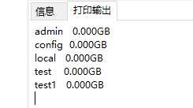
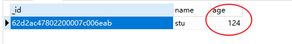
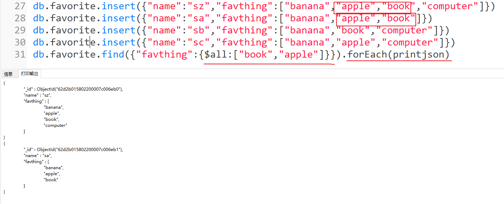

# Mysql和Mongo对应关系


# 常用命令

## 数据库db操作

#### 显示所有数据库：show dbs

可以显示所有数据的列表，新创建的数据库如果没数据从这里是不显示数据库的




#### 显示当前数据库对象：db

#### 连接/切换/创建数据库：use dbname

如果数据库不存在，就创建数据库

```xml
use test
```

#### 删除当前数据库db.dropDatabase()

所以删除只有要先使用use 使用当前数据库

```xml
db.dropDatabase()
```


## 集合（表）and文档(行数据)操作

#### 查看当前数据库所有的集合

```xml
show tables 
show collections
```


#### 插入/创建数据到collection：表

```xml
db.myCollection.insert({"name":"sz","age":123})
```

db.colletctionname.insert({})会自动创建collection集合

*在* *MongoDB* *中，集合只有在内容插入后才会创建**!* *就是说，创建集合**(**数据表**)**后要再插入一个文档**(**记录**)**，集合才会真正创建。*

#### 创建集合

```xml
db.createCollection("site") 
```


#### 删除集合

```xml
db.myCollection.drop()
```


#### 更新文档

```xml
db.myCollection.update({'name':'sz'},{$set:{'name':'sunzhong'}})
```

#### 插入不同文档（允许不同列名）

```mysql
db.myCollection.insert({"name":"sz","age":123})
db.myCollection.insert({"name":"skk","age":123})
db.myCollection.insert({"name":"stt","age":123})
db.myCollection.insert({"tittle":"斗破苍穹","author":"土豆"})
db.myCollection.find()
```


#### 相同记录的插入（id随机不同）

```mysql
father={"name":"sqz"}
mother={"name":"yxx"}
db.myCollection.save(father)
db.myCollection.save(father)
db.myCollection.save(mother)
db.myCollection.find()
```


# mongodb数据类型


# shell连接数据库

```xml
mongodb://[username:password@]host1[:port1][,host2[:port2],...[,hostN[:portN]]][/[database][?options]]
```

·     **mongodb://** 这是固定的格式，必须要指定。

·     **username:password@** 可选项，如果设置，在连接数据库服务器之后，驱动都会尝试登录这个数据库

·     **host1** 必须的指定至少一个host, host1 是这个URI唯一要填写的。它指定了要连接服务器的地址。如果要连接复制集，请指定多个主机地址。

·     **portX** 可选的指定端口，如果不填，默认为27017

·     **/database** 如果指定username:password@，连接并验证登录指定数据库。若不指定，默认打开 test 数据库。

·     **?options** 是连接选项。如果不使用/database，则前面需要加上/。所有连接选项都是键值对name=value，键值对之间通过&或;（分号）隔开


# 查询


####  查询所有记录

```xml
db.myCollection.find()
```

#### 查询一条记录

```mysql
db.myCollection.findOne()
```


#### 删除记录

**相当于where  会删除满足条件的多个记录**

```mysql
db.myCollection.remove({"name":"skk"});
db.myCollection.remove({"age":123});
```


#### and or 一起用

类似常规 SQL 语句为： 'where likes>50 AND (by = '菜鸟教程' OR title = 'MongoDB 教程')'

```xml
db.col.find({"likes": {$gt:50}, $or: [{"by": "菜鸟教程"},{"title": "MongoDB  教程"}]}).pretty()  

{      
	"_id" : ObjectId("56063f17ade2f21f36b03133"),      
	"title" : "MongoDB  教程",      
	"description" : "MongoDB  是一个 Nosql 数据库",      
	"by" : "菜鸟教程",      
	"url" : "http://www.runoob.com",      
	"tags" : [
				"mongodb",
				"database",
				"NoSQL"
			],
	"likes" : 100
}    
```


#### 限制条目数limit  跳过条目数 skip(=offset)

**Find()..Limit()   Find()..skip()**

```mysql
db.myCollection.find().limit(2)
```


#### 排序

**.sort({key:1})  1升序排  -1降序排**

空的 也被差出来，在前面

```mysql
db.myCollection.find().sort({"age":1})
```


#### 索引

```xml
db.col.createIndex({"title":1,"description":-1})#联合索引，1升序-1降序
```


#  高级查询

#### 比较运算符

| 等于 | {<key>:<value>}       | db.col.find({"by":"菜鸟教程"}).pretty()  | where by  = '菜鸟教程' |
| ---- | --------------------- | ---------------------------------------- | ---------------------- |
| 小于 | {<key>:{$lt:<value>}} | db.col.find({"likes":{$lt:50}}).pretty() | where  likes < 50      |

####     条件查询

```mysql
db.myCollection.find({"age":{$gt:123}})
```



#### $all 匹配所有

```mysql
db.myCollection.find({"age":{$gt:123}})
db.favorite.insert({"name":"sz","favthing":["banana","apple","book","computer"]})
db.favorite.insert({"name":"sa","favthing":["banana","apple","book"]})
db.favorite.insert({"name":"sb","favthing":["banana","book","computer"]})
db.favorite.insert({"name":"sc","favthing":["banana","apple","computer"]})
db.favorite.find({"favthing":{$all:["book","apple"]}}).forEach(printjson)
```



####  $exists 判断字段是否存在

 

```mysql
db.favorite.find({"age":{$exists:true}}).forEach(printjson)#查询有这个字段的
```


#### $ne 不等于

#### $in 包含

#### $nin 不包含

####  $size 数组元素个数

```mysql
db.favorite.find({"favthing":{$size:4}}).forEach(printjson)
```


输出


#### count 查询记录条数

```mysql
db.favorite.find({"favthing":{$size:4}}).count()
```

# 聚合操作

没找到

小结：测试代码

```mysql
show dbs
db
use test
db.myCollection.insert({"name":"sz","age":123})
db.myCollection.insert({"name":"skk","age":123})
db.myCollection.insert({"name":"stt","age":123})
db.myCollection.insert({"name":"stu","age":124})
db.myCollection.insert({"name":"ssz","age":121})
db.myCollection.insert({"tittle":"斗破苍穹","author":"土豆"})
db.createCollection("newCollection")
show collections
db.myCollection.update({'name':'sz'},{$set:{'name':'sunzhong'}})
db.myCollection.find()
db.myCollection.find().limit(2)
db.myCollection.remove({"name":"skk"});
db.myCollection.remove({"age":123});
db.myCollection.find({"name":"sunzhong"})
db.myCollection.find().sort({"age":1})
db.myCollection.findOne()
father={"name":"sqz"}
mother={"name":"yxx"}
db.myCollection.save(father)
db.myCollection.save(father)
db.myCollection.save(mother)
db.myCollection.find()
db.myCollection.find({"age":{$gt:123}})
db.favorite.insert({"name":"sz","favthing":["banana","apple","book","computer"]})
db.favorite.insert({"name":"sa","favthing":["banana","apple","book"]})
db.favorite.insert({"name":"sb","favthing":["banana","book","computer"]})
db.favorite.insert({"name":"sc","favthing":["banana","apple","computer"]})
db.favorite.find({"favthing":{$all:["book","apple"]}}).forEach(printjson)
db.favorite.insert({"name":"sc","favthing":["banana","apple","computer"],"age":1000})
db.favorite.find()
db.favorite.find({"age":{$exists:true}}).forEach(printjson)
// $size 数组元素个数
db.favorite.find({"favthing":{$size:4}}).forEach(printjson)
db.favorite.find({"favthing":{$size:4}}).count()
```


# java操作mongodb

#### 插入文档

```java
import java.util.ArrayList;
import java.util.List;
import org.bson.Document;

import com.mongodb.MongoClient;
import com.mongodb.client.MongoCollection;
import com.mongodb.client.MongoDatabase;

public class MongoDBJDBC{
   public static void main( String args[] ){
      try{   
         // 连接到 mongodb 服务
         MongoClient mongoClient = new MongoClient( "localhost" , 27017 );
         
         // 连接到数据库
         MongoDatabase mongoDatabase = mongoClient.getDatabase("mycol");  
         System.out.println("Connect to database successfully");
         
         MongoCollection<Document> collection = mongoDatabase.getCollection("test");
         //mongoDatabase.createCollection("test");  创建集合
         System.out.println("集合 test 选择成功");
         //插入文档  
         /** 
         * 1. 创建文档 org.bson.Document 参数为key-value的格式 
         * 2. 创建文档集合List<Document> 
         * 3. 将文档集合插入数据库集合中 mongoCollection.insertMany(List<Document>) 插入单个文档可以用 mongoCollection.insertOne(Document) 
         * */
         Document document = new Document("title", "MongoDB").  
         append("description", "database").  
         append("likes", 100).  
         append("by", "Fly");  
         List<Document> documents = new ArrayList<Document>();  
         documents.add(document);  
         collection.insertMany(documents);  
         System.out.println("文档插入成功");  
      }catch(Exception e){
         System.err.println( e.getClass().getName() + ": " + e.getMessage() );
      }
   }
}
```

#### 检索文档

```java
//检索所有文档  
/** 
         * 1. 获取迭代器FindIterable<Document> 
         * 2. 获取游标MongoCursor<Document> 
         * 3. 通过游标遍历检索出的文档集合 
         * */  
FindIterable<Document> findIterable = collection.find();  
MongoCursor<Document> mongoCursor = findIterable.iterator();  
while(mongoCursor.hasNext()){  
    System.out.println(mongoCursor.next());  
}  
```

#### 更新文档

```java
//更新文档   将文档中likes=100的文档修改为likes=200   
collection.updateMany(Filters.eq("likes", 100), new Document("$set",new Document("likes",200)));  
//检索查看结果  
FindIterable<Document> findIterable = collection.find();  
MongoCursor<Document> mongoCursor = findIterable.iterator();  
while(mongoCursor.hasNext()){  
    System.out.println(mongoCursor.next());  
}  
```

#### 删除文档

```java
//删除符合条件的第一个文档  
collection.deleteOne(Filters.eq("likes", 200));  
//删除所有符合条件的文档  
collection.deleteMany (Filters.eq("likes", 200));  
```

