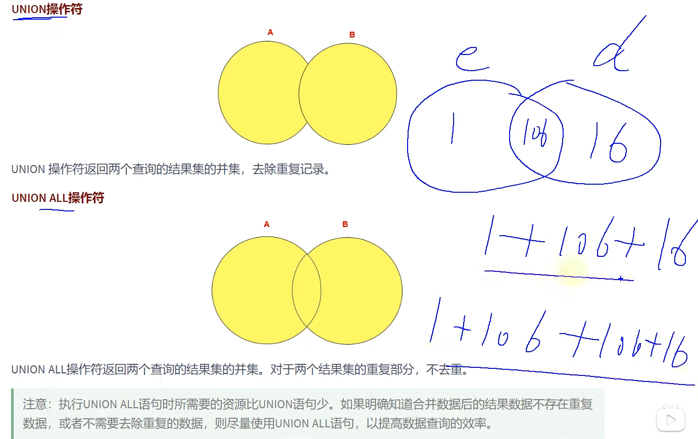
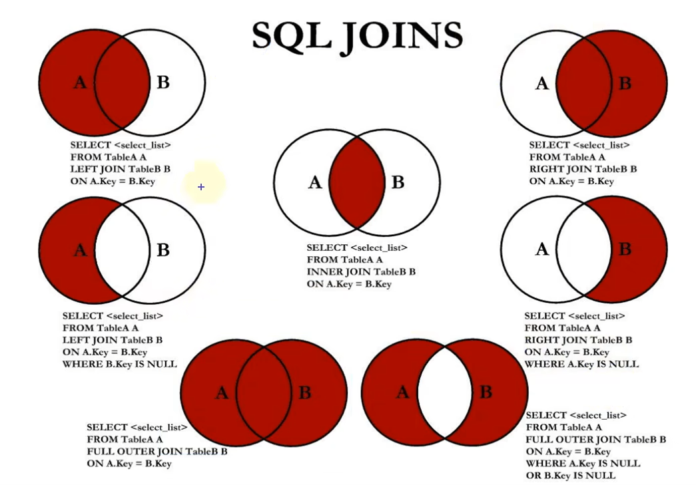

# mysql

## mysql常用命令

#### 远程连接不同版本数据库：

```mysql
mysql -uroot -psz@mysql -h10.128.22.34 -P3306
```


#### 查看字符集

```mysql
show variables like "character_%";
```

#### 修改数据库默认字符集

```mysql
set character_set_connectiont=utf8;//要重启数据库
```

#### 修改数据库的字符编码为utf8

```mysql
alter database 0728db charset utf8; 
```

#### 修改表字符编码为UTF8 

```mysql
alter table student charset utf8; 
```

#### 修改字段字符编码为UTF8

```mysql
alter table student modify name varchar(20) charset utf8;
```

#### mysql，root用户忘记密码

1: 通过任务管理器或者服务管理，关掉mysqld(服务进程) //ctrl + shift +esc 下面

2: 通过命令行+特殊参数开启mysqld mysqld --defaults-file="D:\ProgramFiles\mysql\MySQLServer5.7Data\my.ini" --skip-grant-tables 

3: 此时，mysqld服务进程已经打开。并且不需要权限检查 

4: mysql -uroot 无密码登陆服务器。另启动一个客户端进行 

5: 修改权限表 

（1） use mysql; 

（2）update user set authentication_string=password('新密码') where user='root' and Host='localhost'; 

（3）flush privileges;

6: 通过任务管理器，关掉mysqld服务进程。 

7: 再次通过服务管理，打开mysql服务。 

8: 即可用修改后的新密码登陆。

#### mysql 导入文件

source+数据库文件的全路径名#不用加引号，并且只能在命令行使用

#### 空值参与运算

```mysql
select salary * (1+rate)*12 "年工资"#当rate为null时，年工资也为null
select salary where rate=null;#不会查到任何东西  null不能参与运算
#为了解决null参与=运算  使用安全等于  <=>    
select salary where rate<=>null;//可以查到
```

#### 关键字

```mysql
IS NULL 
IS NOT NULL
like  #where name like '%s%'  需要注意  %是0个或多个   _是一个  通配符   \转义
ISNULL(rate)
least()
greatest()
length()
between ... and ... #[]   闭区间   并且  左边需要小于右边  连续
in  / not in   // where id in (1,2,3);   离散
regexp  #正则表达式  where  name regexp '^a'
```


#### `  着重号

解决命名冲突问题，当名称和保留字冲突时，将名称加上着重号

显示表结构,跟 show create table user比较像

```mysql
describe user;//等同于desc
```

#### 别名在where中不起作用：select  xx from xx   执行顺序：先执行from 

```mysql
selecet username,salary*12 an_salary from user  where an_salary >10000; //  错误
selecet username,salary*12 an_salary from user order  by an_salary; //正确
```

分页

```mysql
select * from user limit offset,pagesize;// offset= (pageIndex-1)*pageSize  查出来的是offset之后的 因为最开始是0
```

#### 查询所有员工.....外连接(怎么实现全连接？)

<font color="red">**mysql不支持full  join**</font>


</img>

</img>

<font color="red">为什么需要join? </font>

 因为直接等值连接会导致数据的丢失，尤其是空值多表查询时候。

```mysql
查询所有有奖金员工的xx信息
e.commition_ept from  e left join on  ...  left join  on ...
```

#### 内连接的两种表达方式inner join 与where子句

其实都是求两个或两个以上表的交集，inner join 是内连接，where 是条件判断语句，用where语句可以实现内连接的功能，

但区别在于where 语句还可以加上其他条件，而inner join则不可以了。

```mysql
#例如：
select a.*,b.* from a inner join b on a.id = b.id
#等同于
select a.*,b.* from a,b where a.id = b.id
#但如果用语句二的还可以接着写条件，语句一则要新添where语句
```

#### 流程控制

```mysql
select name,salary,if(salary>=6000,"高工资","低工资") "薪资水平";
select name,rate,if(rate is not null,rate,0) "利率"


#分类处理   case when then when then else end
select name,salary case when salary>=15000 then "高富帅"
                        when salary>=8000 then "潜力股"
                        when salary>=1000 then "还行吧"
                        else "草根" end "详情"
                        from xxx;
```

#### 常见的聚合函数:  输入多行，输出一行

<font color="red"> 空值怎么处理呢？</font>

<font color="red"> avg()=sum()/count()</font>

但是求平均值时候  他们忽略了null值，遇到null，当做不存在的数据，其实是不合适的

```mysql
#avg sum   
select avg(salary)  "平均工资",sum(salary) "总工资" from employee;
#max  min
select max(salary)  "最高工资",min(salary) "最低工资" from employee;
#count
select count(*) from user;  #一般用来统计多少条数据  
select count(1) from user;  #一般用来统计多少条数据  
select count(name) from user;  #当name 为null时  不包括，所以<= 数据量
#grop by  分组按照某个字段
select department_id,avg(salary) group by department_id;#查询每个部门的平均工资
select department_id,job_id,avg(salary) group by department_id,job_id;#查询每个部门每类工作的平均工资，双重分组
select department_id,job_id,avg(salary) group by job_id,department_id;#查询每个部门每类工作的平均工资，双重分组  并且和上面一样，都是每个部门每个工种的平均工资，select 出现的字段(非函数内部) 都需要出现在group by 里面
#having
#要求  过滤条件中出现聚合函数，having 替换 where,并且 放在grop by 之后
select department_id,max(salary) from employees grop by department_id having max(salary)>=10000;#查询最高工资大于10000的部门信息

#where 能做的 having 也能做，但是 where 效率比having 高，尤其多表查询时，where 先筛选后连接，having先连接后查询
```

#### SQL执行流程(极其重要！！！)

```mysql
/*
sql语法：						执行顺序
select ...,...,(存在聚合函数)    #2
from ....					   #1
where ....					   #1
group by ...				   #1
having .... asc/desc		   #1
limit ...					   #3
*/

		笛卡尔积  连接过滤
# from   ..,...  -->on-->where  -->   group by  -->having
#  select  删除列
#  limit


```

#### 子查询

**单行子查询，子查询返回值只有一个值**

```mysql
#查询工资大于149号员工工资的员工信息
select salary 
from employees 
where salary > (
	select salary 
    from employees
    where employee_id=149
);
#返回job_id与141号员工相同，salary比143号员工多的员工姓名
select employee_name 
from employees
where job_id=(
	select job_id from employees where employee_id=143
)
and salary > (
	select salary from employees where employee_id=143
);
```

**多行子查询，子查询返回的结果有多个行**

- **in:等于列表中的任意一个**
- **any:需要和单行比较操作符一起使用，和子查询返回的某一个值比较。**
- **all:需要和单行比较操作符一起使用，和子查询返回的所有值比较**
- **some：和any完全一样**

```mysql
#返回其他job_id中比job_id为'IT_PROG'中任一员工工资低的员工
select * 
from employees
where job_id!='IT_PROG'
and salary< any(
	select salary from employees where job_id='IT_PROG'
);

#查询平均工资最低的部门id
select department_id
from employees
group by department_id
having avg(salary)=(
	select min(avg_sal) from(
    	select avg(salary) avg_sal
        from employees group by department_id
    ) temp_table_name# 作为临时表 找到所有工资，列明avg_sal
)
```

#### 相关子查询

```mysql
#查询员工中工资大于本部门平均工资的员工的last_name和department_id
select last_name,department_id 
from employees s
where salary>(
	select avg(salary) 
    from emploryees t
    where t.department_id=s.department_id
);

#查询员工id  salary 按照department_name排序
select  employee_id,salary from employees s
order by(
	select department_name from departments t
    where t.department_id=s.department_id
);	

# exists   not exists
#查询公司管理者的id  name
select employee_id,last_name 
from employees s
where exists(
	select employee_id from employees t
    where t.manage_id=s.employee_id
);
#查询departments表中不存在于employees表中的部门的department_id,department_name
select department_id,department_name 
from departments d
where not exists(
	select * from employees e
    where e.department_id=d.department_id
);


```

前52个视频  exists的习题没看，下面从96开始看

6.17：109-111

6.18：119-132

6.19：161-186

6.20：


#### 常用命令

```mysql
#创建普通索引
CREATE TABLE book( book_id INT ,year_publication YEAR, INDEX(year_publication) );
#创建唯一索引
CREATE TABLE test1( id INT NOT NULL, name varchar(30) NOT NULL, UNIQUE INDEX uk_idx_id(id));#包含索引名
#创建单列索引
CREATE TABLE test2( id INT NOT NULL, name CHAR(50) NULL, INDEX single_idx_name(name(20)) );
#创建联合索引
CREATE TABLE test3( id INT(11) NOT NULL, INDEX multi_idx(id,name,age) );
#创建全文索引
CREATE TABLE test4( id INT NOT NULL, FULLTEXT INDEX futxt_idx_info(info) ) ENGINE=MyISAM;

#在已有表上添加索引
ALTER TABLE table_name ADD [UNIQUE | FULLTEXT | SPATIAL] [INDEX | KEY] [index_name] (col_name[length],...) [ASC | DESC]

#删除索引
DROP INDEX index_name ON table_name;
ALTER TABLE table_name DROP INDEX index_name;

#查看表的索引
SHOW INDEX FROM test3；
```

#### **哪些情况适合创建索引**

1. 字段的数值有唯一性的限制
2. 频繁作为WHERE 查询条件的字段
3. 经常 GROUP BY 和 ORDER BY 的列
4. UPDATE**、**DELETE 的 WHERE 条件列
5. .DISTINCT 字段需要创建索引
6. 多表 JOIN 连接操作时，创建索引注意事项
7. 使用列的类型小的创建索引 
8. 使用字符串前缀创建索引
9. 在多个字段都要创建索引的情况下，联合索引优于单值索引 
10. 区分度高(散列性高)的列适合作为索引 
11. 使用最频繁的列放到联合索引的左侧

#### 查询用到的索引

```mysql
EXPLAIN select * from employees where employee_id>100;
```

数据库事务

```mysql
#开启事务
start transaction;
#或
begin;
#提交事务
commit;
#回滚
rollback;
#查看当前的事务隔离级别
SHOW VARIABLES LIKE 'transaction_isolation';
#或
select @@transaction_isolation;
#设置事务的隔离级别
set session transaction_isolation="REPEATABLE-READ"
```

#### 解决 脏读 、 不可重复读 、 幻读的两种方案

1、MVCC

2、加锁

- 采用 MVCC 方式的话， 读-写 操作彼此并不冲突， 性能更高 。
- 采用 加锁 方式的话， 读-写 操作彼此需要 排队执行 ，影响性能。

一般情况下我们当然愿意采用 MVCC 来解决 读-写 操作并发执行的问题，但是业务在某些特殊情况下，要求必须采用 加锁 的方式执行。


#### 表级锁:S锁、X锁

innodb默认的是行级锁，但是在数据库恢复时，需要使用表锁

```mysql
#加表t加S锁
lock tables t read;
#加表t加X锁
lock tables t write;
```

#### 意向锁：

**意向锁要解决的问题**

现在有两个事务，分别是T1和T2，其中T2试图在该表级别上应用共享或排它锁，如果没有意向锁存在，那么T2就需要去检查各个页或行是否存在锁；如果存在意向锁，那么此时就会受到由T1控制的`表级别意向锁的阻塞`。T2在锁定该表前不必检查各个页或行锁，而只需检查表上的意向锁。简单来说就是给更大一级级别的空间示意里面是否已经上过锁。

在数据表的场景中，**如果我们给某一行数据加上了排它锁，数据库会自动给更大一级的空间，比如数据页或数据表加上意向锁，告诉其他人这个数据页或数据表已经有人上过排它锁了**，这样当其他人想要获取数据表排它锁的时候，只需要了解是否有人已经获取了这个数据表的意向排它锁即可。

- 如果事务想要获取数据表中某些记录的共享锁，就需要在数据表上`添加意向共享锁`
- 如果事务想要获取数据表中某些记录的排它锁，就需要在数据表上`添加意向排他锁`

这时，意向锁会告诉其他事务已经有人锁定了表中的某些记录。

```mysql
-- 事务要获取某些行的 S 锁，必须先获得表的 IS 锁。 
SELECT column FROM table ... LOCK IN SHARE MODE;
-- 事务要获取某些行的 X 锁，必须先获得表的 IX 锁。 
SELECT column FROM table ... FOR UPDATE;
```

#### 间隙锁

MySQL 在 REPEATABLE READ 隔离级别下是可以解决幻读问题的，解决方案有两种，可以使用 MVCC 方案解决，也可以采用 加锁 方案解决。但是在使用加锁方案解决时有个大问题，就是事务在第一次执行读取操作时，那些幻影记录尚不存在，我们无法给这些 幻影记录 加上 记录锁 。InnoDB提出了一种称之为Gap Locks 的锁，官方的类型名称为： LOCK_GAP ，我们可以简称为 gap锁 。


#### 

#### **隐藏字段、**Undo Log**版本链**

回顾一下undo日志的版本链，对于使用 InnoDB 存储引擎的表来说，它的聚簇索引记录中都包含两个必要的隐藏列。

- trx_id ：每次一个事务对某条聚簇索引记录进行改动时，都会把该事务的 事务id 赋值给trx_id 隐藏列。
- roll_pointer ：每次对某条聚簇索引记录进行改动时，都会把旧的版本写入到 undo日志 中，然后这个隐藏列就相当于一个指针，可以通过它来找到该记录修改前的信息。

#### MVCC 的实现依赖于：**隐藏字段、**Undo Log**、**Read View。


#### ReadView

使用 READ COMMITTED 和 REPEATABLE READ 隔离级别的事务，都必须保证读到 已经提交了的 事务修改过的记录。假如另一个事务已经修改了记录但是尚未提交，是不能直接读取最新版本的记录的，核心问题就是需要判断一下版本链中的哪个版本是当前事务可见的，这是ReadView要解决的主要问题

1. creator_trx_id ，创建这个 Read View 的事务 ID。

说明：只有在对表中的记录做改动时（执行INSERT、DELETE、UPDATE这些语句时）才会为事务分配事务id，否则在一个只读事务中的事务id值都默认为0。 

2. trx_ids ，表示在生成ReadView时当前系统中活跃的读写事务的 事务id列表 。 

3. up_limit_id ，活跃的事务中最小的事务 ID。 

4. low_limit_id ，表示生成ReadView时系统中应该分配给下一个事务的 id 值。low_limit_id 是系

统最大的事务id值，这里要注意是系统中的事务id，需要区别于正在活跃的事务ID。

#### ReadView的规则

- 如果被访问版本的trx_id属性值与ReadView中的 creator_trx_id 值相同，意味着当前事务在访问它自己修改过的记录，所以该版本可以被当前事务访问。

- 如果被访问版本的trx_id属性值小于ReadView中的 up_limit_id 值，表明生成该版本的事务在当前事务生成ReadView前已经提交，所以该版本可以被当前事务访问。

- 如果被访问版本的trx_id属性值大于或等于ReadView中的 low_limit_id 值，表明生成该版本的事务在当前事务生成ReadView后才开启，所以该版本不可以被当前事务访问。

- 如果被访问版本的trx_id属性值在ReadView的 up_limit_id 和 low_limit_id 之间，那就需要判断一下trx_id属性值是不是在 trx_ids 列表中。

  - 如果在，说明创建ReadView时生成该版本的事务还是活跃的，该版本不可以被访问。

  - 如果不在，说明创建ReadView时生成该版本的事务已经被提交，该版本可以被访问。


#### MVCC**整体操作流程**

了解了这些概念之后，我们来看下当查询一条记录的时候，系统如何通过MVCC找到它：

1. 首先获取事务自己的版本号，也就是事务 ID； 

2. 获取 ReadView； 

3. 查询得到的数据，然后与 ReadView 中的事务版本号进行比较；

4. 如果不符合 ReadView 规则，就需要从 Undo Log 中获取历史快照；

5. 最后返回符合规则的数据。


