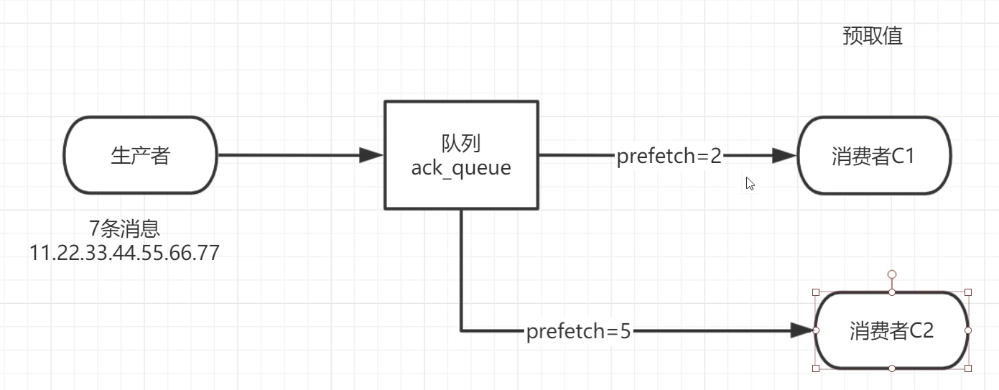

# Docker 启动rabbitmq

```linux
docker run -e RABBITMQ_DEFAULT_USER=sz -e RABBITMQ_DEFAULT_PASS=java --name mq -p 15672:15672 -p 5672:5672 -d rabbitmq:3-management
```


# 入门

## 消息生产者

```java
private final static  String QUEUE_NAME="myqueue";
public static void main(String[] args) throws IOException, TimeoutException, InterruptedException {
    //创建一个连接工厂
    ConnectionFactory factory = new ConnectionFactory();
    factory.setHost("192.168.222.132");
    factory.setUsername("root");
    factory.setPassword("123456");
    //channel 实现了自动 close 接口 自动关闭 不需要显示关闭
    try(Connection connection = factory.newConnection();Channel channel =
        connection.createChannel()) {
        /**
         * 生成一个队列
         * 1.队列名称
         * 2.队列里面的消息是否持久化 默认消息存储在内存中
         * 3.该队列是否只供一个消费者进行消费 是否进行共享 true 可以多个消费者消费
         * 4.是否自动删除 最后一个消费者端开连接以后 该队列是否自动删除 true 自动删除
         * 5.其他参数
         */
        channel.queueDeclare(QUEUE_NAME, false, false, false, null);
        String message = "hello world";
        /**
         * 发送一个消息
         * 1.发送到那个交换机
         * 2.路由的 key 是哪个
         * 3.其他的参数信息
         * 4.发送消息的消息体
         */
        channel.basicPublish("", QUEUE_NAME, null, message.getBytes());
        System.out.println("消息发送完毕");
        Thread.sleep(10000);
    }
}
```

## 消息消费者

```java
private final static  String QUEUE_NAME="myqueue";
public static void main(String[] args) throws IOException, TimeoutException {
    ConnectionFactory factory = new ConnectionFactory();
    factory.setHost("192.168.222.132");
    factory.setUsername("root");
    factory.setPassword("123456");
    Connection connection = factory.newConnection();
    Channel channel = connection.createChannel();
    System.out.println("等待接收消息....");
    //推送的消息如何进行消费的接口回调
    DeliverCallback deliverCallback=(consumerTag,delivery)->{
        String message= new String(delivery.getBody());
        System.out.println(message);
    };
    //取消消费的一个回调接口 如在消费的时候队列被删除掉了
    CancelCallback cancelCallback=(consumerTag)->{
        System.out.println("消息消费被中断");
    };
    /**
     * 消费者消费消息
     * 1.消费哪个队列
     * 2.消费成功之后是否要自动应答 true 代表自动应答 false 手动应答
     * 3.消费者未成功消费的回调
     */
    channel.basicConsume(QUEUE_NAME,true,deliverCallback,cancelCallback);
}
```

# Work Queues

## 轮训分发消息

我们把任务封装为消息并将其发送到队列。在后台运行的工作进程将弹出任务并最终执行作业。当有多个工作线程时，这些工作线程将一起处理这些任务。

启动两个工作线程，一个消息发送线程，我们来看看他们两个工作线程是如何工作的。


### 抽取工具类

```java
public class RabbitmqUtils {
    public static Channel getChannel() throws IOException, TimeoutException {
        ConnectionFactory connectionFactory = new ConnectionFactory();
        connectionFactory.setHost("192.168.222.132");
        connectionFactory.setUsername("root");
        connectionFactory.setPassword("123456");
        connectionFactory.setPort(15672);
        Connection connection = connectionFactory.newConnection();
        Channel channel = connection.createChannel();
        return channel;
    }
}
```

### 两个消费者线程

```java
public class Worker01 {
    private static final String QUEUE_NAME="hello";
    public static void main(String[] args) throws Exception {
        Channel channel = RabbitMqUtils.getChannel();
        DeliverCallback deliverCallback=(consumerTag,delivery)->{
            String receivedMessage = new String(delivery.getBody());
            System.out.println("接收到消息:"+receivedMessage);
        };
        CancelCallback cancelCallback=(consumerTag)->{
            System.out.println(consumerTag+"消费者取消消费接口回调逻辑");
        };
        System.out.println("Cx 消费者启动等待消费......");
        channel.basicConsume(QUEUE_NAME,true,deliverCallback,cancelCallback);
    } 
}
```

### 一个生产者线程

```java
public class Task01 {
    private static final String QUEUE_NAME="hello";
    public static void main(String[] args) throws Exception {
        try(Channel channel=RabbitMqUtils.getChannel();) {
            channel.queueDeclare(QUEUE_NAME,false,false,false,null);
            //从控制台当中接受信息
            Scanner scanner = new Scanner(System.in);
            while (scanner.hasNext()){
                String message = scanner.next();
                channel.basicPublish("",QUEUE_NAME,null,message.getBytes());
                System.out.println("发送消息完成:"+message);
            }
        }
    } }
```

# 消息应答

消费者完成一个任务可能需要一段时间，如果其中一个消费者处理一个长的任务并仅只完成了部分突然它挂掉了，会发生什么情况。

RabbitMQ 一旦向消费者传递了一条消息，便立即将该消息标记为删除。在这种情况下，突然有个消费者挂掉了，我们将丢失正在处理的消息。以及后续

发送给该消费这的消息，因为它无法接收到。

**为了保证消息在发送过程中不丢失，rabbitmq 引入消息应答机制，消息应答就是:消费者在接收到消息并且处理该消息之后，告诉 rabbitmq 它已经处理了，rabbitmq 可以把该消息删除了。**


## 自动应答

消息发送后立即被认为已经传送成功，这种模式需要在**高吞吐量和数据传输安全性方面做权衡**,因为这种模式如果消息在接收到之前，消费者那边出现连接或者 channel 关闭，那么消息就丢失了,当然另一方面这种模式消费者那边可以传递过载的消息，**没有对传递的消息数量进行限制**，当然这样有可能使得消费者这边由于接收太多还来不及处理的消息，导致这些消息的积压，最终使得内存耗尽，最终这些消费者线程被操作系统杀死，

**所以这种模式仅适用在消费者可以高效并以某种速率能够处理这些消息的情况下使用**。


## 手动应答

**消息应答的方法** 

**A**.Channel.basicAck(用于肯定确认) RabbitMQ 已知道该消息并且成功的处理消息，可以将其丢弃了

**B**.Channel.basicNack(用于否定确认) 

**C**.Channel.basicReject(用于否定确认) 与 Channel.basicNack 相比少一个参数不处理该消息了直接拒绝，可以将其丢弃了


multiple 的 true 和 false 代表不同意思

- true 代表批量应答 channel 上未应答的消息 比如说 channel 上有传送 tag 的消息 5,6,7,8 当前 tag 是 8 那么此时5-8 的这些还未应答的消息都会被确认收到消息应答
- false 同上面相比只会应答 tag=8 的消息 5,6,7 这三个消息依然不会被确认收到消息应答

## 消息自动重新入队机制

如果消费者由于某些原因失去连接(其通道已关闭，连接已关闭或 TCP 连接丢失)，导致消息未发送 ACK 确认，RabbitMQ 将了解到消息未完全处理，并将对其重新排队。如果此时其他消费者可以处理，它将很快将其重新分发给另一个消费者。这样，即使某个消费者偶尔死亡，也可以确保不会丢失任何消息。


## 预取值




