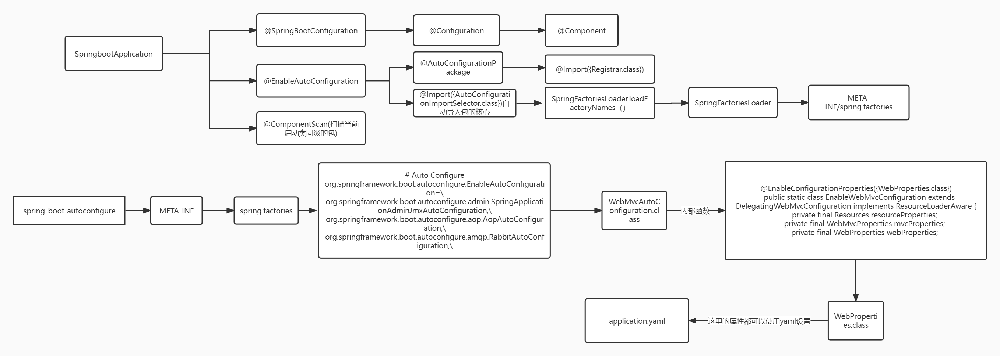
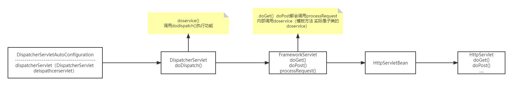

# 自动配置

## springbot启动类

```java
package com.springbootstudy;

import com.springbootstudy.bean.User;
import org.springframework.boot.SpringApplication;
import org.springframework.boot.autoconfigure.SpringBootApplication;
import org.springframework.context.ConfigurableApplicationContext;
@SpringBootApplication
public class Springboot01HelloworldApplication {

    public static void main(String[] args) {
        //
        ConfigurableApplicationContext run = SpringApplication.run(Springboot01HelloworldApplication.class, args);
        //bean获取
        String names[] = run.getBeanDefinitionNames();
		User user = (User)run.getBean("user");
        boolean car = run.containsBean("car");
    }
}
```


# SpringBoot自动配置

</img>

## 常用注解

#### @SpringBootApplication

```java
@Target(ElementType.TYPE)
@Retention(RetentionPolicy.RUNTIME)
@Documented
@Inherited
@SpringBootConfiguration
@EnableAutoConfiguration
@ComponentScan(excludeFilters = { @Filter(type = FilterType.CUSTOM, classes = TypeExcludeFilter.class),
		@Filter(type = FilterType.CUSTOM, classes = AutoConfigurationExcludeFilter.class) })
public @interface SpringBootApplication {
	@AliasFor(annotation = EnableAutoConfiguration.class)
	Class<?>[] exclude() default {};
	@AliasFor(annotation = EnableAutoConfiguration.class)
	String[] excludeName() default {};
	@AliasFor(annotation = ComponentScan.class, attribute = "basePackages")
	String[] scanBasePackages() default {};
	@AliasFor(annotation = ComponentScan.class, attribute = "basePackageClasses")
	Class<?>[] scanBasePackageClasses() default {};
	@AliasFor(annotation = ComponentScan.class, attribute = "nameGenerator")
	Class<? extends BeanNameGenerator> nameGenerator() default BeanNameGenerator.class;
	@AliasFor(annotation = Configuration.class)
	boolean proxyBeanMethods() default true;
}
```

#### @SpringBootConfiguration

```java
@Target({ElementType.TYPE})
@Retention(RetentionPolicy.RUNTIME)
@Documented
@Configuration
@Indexed
public @interface SpringBootConfiguration {
    @AliasFor(
        annotation = Configuration.class
    )
    boolean proxyBeanMethods() default true;
}
```

#### @Configuration

```java
@Target({ElementType.TYPE})
@Retention(RetentionPolicy.RUNTIME)
@Documented
@Component
public @interface Configuration {
    @AliasFor(
        annotation = Component.class
    )
    String value() default "";
    boolean proxyBeanMethods() default true;
}
```

## 配置类，将类注入为组件

#### @Configuration 配置类

####  @Bean 

```java
/*
 * 1. 声明为配置类,本身就是组件
 * 2. MyConfig bean, proxybeanmethods=true 
 * 3. proxyBeanMethods=false, 
 */
@Configuration
public class ConfigurationTest {
    @Bean//方法名是id   
    public User user1(){//
        return new User(1,"tom","?",13);
    }
}

```

#### @Import 

```java
@Import({Car.class})
@Configuration//
public class ImportTest {}
```


- @Bean
- @import

#### @ConditionalOnBean@ConditionalOnMissingBean@ConditionalOnWebApplication...........

#### @ImportResource("classpath:bean.xml")

<font color="red">属性绑定配置文件两种方式</font>

#### @ConfigurationProperties+Compont

比如db.properties   key:value?

```java
/*
 *Dog.java
 */
@Component//将组件放到容器中
@ConfigurationProperties(prefix = "dog")//绑定配置文件  application.yaml,  前缀dog
public class Dog {
    private Integer id;
    private String name;
}

/*
 *application.yaml
 */
dog.id=1
dog.name=wangcai
```

#### @ConfigurationProperties+EnableConfigurationProperties:更常用！！！

```java
/*
 *Dog.java
 */
@ConfigurationProperties(prefix = "dog")//绑定配置文件  application.yaml,  前缀dog
public class Dog {
    private Integer id;
    private String name;
}
/*
 *EnableConfigurationPropertisTest.java
 */
@Configuration// 声明配置类，本身就是组件
@EnableConfigurationProperties({Dog.class})//??
public class EnableConfigurationPropertisTest {

}
//##########################??#####################################
//        Dog dog = run.getBean("dog", Dog.class);
//        System.out.println(dog);
//       

@RestController
public class DogController {
    @Autowired
    Dog dog;
    @RequestMapping("/dog")
    public Dog getDog(){
        return dog;
    }
}
```

#### @ConfigurationProperties作用在@Bean上，Bean绑定配置文件！！！！！

```java
@Configuration
public class MyDataSourceConfig{
    @ConfigurationProperties(prefix="spring.datasource")
    @Bean
    public DataSource datasource(){
        return new DruidDataSource();
    }
}
```


#### springboot  AOP

```java
@Configuration(proxyBeanMethods = false)
@ConditionalOnProperty(prefix = "spring.aop", name = "auto", havingValue = "true", matchIfMissing = true)
public class AopAutoConfiguration {

	@Configuration(proxyBeanMethods = false)
	@ConditionalOnClass(Advice.class)
	static class AspectJAutoProxyingConfiguration {
        // jdk动态代理
		@Configuration(proxyBeanMethods = false)
		@EnableAspectJAutoProxy(proxyTargetClass = false)
		@ConditionalOnProperty(prefix = "spring.aop", name = "proxy-target-class", havingValue = "false")
		static class JdkDynamicAutoProxyConfiguration {}
		//cglib动态代理
        @Configuration(proxyBeanMethods = false)
		@EnableAspectJAutoProxy(proxyTargetClass = true)
		@ConditionalOnProperty(prefix = "spring.aop", name = "proxy-target-class", havingValue = "true",
				matchIfMissing = true)
		static class CglibAutoProxyConfiguration {
		}
}
```

#### DispatcherServlet原理分析

</img>

##### **DispatcherServletAutoConfiguration.java**

```java
@AutoConfigureOrder(Ordered.HIGHEST_PRECEDENCE)
@Configuration(proxyBeanMethods = false)
@ConditionalOnWebApplication(type = Type.SERVLET)
@ConditionalOnClass(DispatcherServlet.class)
@AutoConfigureAfter(ServletWebServerFactoryAutoConfiguration.class)
public class DispatcherServletAutoConfiguration {
	@Configuration(proxyBeanMethods = false)
	@Conditional(DefaultDispatcherServletCondition.class)
	@ConditionalOnClass(ServletRegistration.class)
	@EnableConfigurationProperties(WebMvcProperties.class)//?????????????????????@ConfigurationProperties  ??????????????
	protected static class DispatcherServletConfiguration {
		@Bean(name = DEFAULT_DISPATCHER_SERVLET_BEAN_NAME)
		public DispatcherServlet dispatcherServlet(WebMvcProperties webMvcProperties) {
			DispatcherServlet dispatcherServlet = new DispatcherServlet();
			dispatcherServlet.setDispatchOptionsRequest(webMvcProperties.isDispatchOptionsRequest());
			dispatcherServlet.setDispatchTraceRequest(webMvcProperties.isDispatchTraceRequest());
			dispatcherServlet.setThrowExceptionIfNoHandlerFound(webMvcProperties.isThrowExceptionIfNoHandlerFound());
			dispatcherServlet.setPublishEvents(webMvcProperties.isPublishRequestHandledEvents());
			dispatcherServlet.setEnableLoggingRequestDetails(webMvcProperties.isLogRequestDetails());
			return dispatcherServlet;
		}

		@Bean
		@ConditionalOnBean(MultipartResolver.class)
		@ConditionalOnMissingBean(name = DispatcherServlet.MULTIPART_RESOLVER_BEAN_NAME)//name=multipartResolver
        
		public MultipartResolver multipartResolver(MultipartResolver resolver) {
			// Detect if the user has created a MultipartResolver but named it incorrectly
			return resolver;
		}

	....
	....
}
```


##### **WebMvcProperties.java**

```java
@ConfigurationProperties(prefix = "spring.mvc")
public class WebMvcProperties {
	/**
	 * Path pattern used for static resources.   ??????
	 */
	private String staticPathPattern = "/**";
	private final Async async = new Async();
	private final Servlet servlet = new Servlet();
	private final View view = new View();
	private final Contentnegotiation contentnegotiation = new Contentnegotiation();
	private final Pathmatch pathmatch = new Pathmatch();

	public static class Async {
	}

	public static class Servlet {
	}
	//????????????
	public static class View {
		private String prefix;
		private String suffix;
		get/set
	}
	...
}
```

# webmvc

**WebMVCAutoConfiguration.java**

```java
@Configuration(proxyBeanMethods = false)
@ConditionalOnWebApplication(type = Type.SERVLET)
@ConditionalOnClass({ Servlet.class, DispatcherServlet.class, WebMvcConfigurer.class })
@ConditionalOnMissingBean(WebMvcConfigurationSupport.class)
@AutoConfigureOrder(Ordered.HIGHEST_PRECEDENCE + 10)
@AutoConfigureAfter({ DispatcherServletAutoConfiguration.class, TaskExecutionAutoConfiguration.class,
		ValidationAutoConfiguration.class })
public class WebMvcAutoConfiguration {
	@Configuration(proxyBeanMethods = false)
	@EnableConfigurationProperties(WebProperties.class)
	public static class EnableWebMvcConfiguration extends DelegatingWebMvcConfiguration implements ResourceLoaderAware {
		private final Resources resourceProperties;
		private final WebMvcProperties mvcProperties;
		private final WebProperties webProperties;
		private final ListableBeanFactory beanFactory;
		private final WebMvcRegistrations mvcRegistrations;
		private ResourceLoader resourceLoader;
		public EnableWebMvcConfiguration(WebMvcProperties mvcProperties, WebProperties webProperties,
				ObjectProvider<WebMvcRegistrations> mvcRegistrationsProvider,
				ObjectProvider<ResourceHandlerRegistrationCustomizer> resourceHandlerRegistrationCustomizerProvider,
				ListableBeanFactory beanFactory) {
			this.resourceProperties = webProperties.getResources();
			this.mvcProperties = mvcProperties;
			this.webProperties = webProperties;
			this.mvcRegistrations = mvcRegistrationsProvider.getIfUnique();
			this.beanFactory = beanFactory;
		}
    }
  
    public void addResourceHandlers(ResourceHandlerRegistry registry) {
			if (!this.resourceProperties.isAddMappings()) {
				logger.debug("Default resource handling disabled");
				return;
			}
			addResourceHandler(registry, "/webjars/**", "classpath:/META-INF/resources/webjars/");
			addResourceHandler(registry, this.mvcProperties.getStaticPathPattern(), (registration) -> {
				registration.addResourceLocations(this.resourceProperties.getStaticLocations());
				if (this.servletContext != null) {
					ServletContextResource resource = new ServletContextResource(this.servletContext, SERVLET_LOCATION);
					registration.addResourceLocations(resource);
				}
			});
		}
    ....
}
```

**WebProperties.java**

```java
@ConfigurationProperties("spring.web")
public class WebProperties {
	private Locale locale;
	private LocaleResolver localeResolver = LocaleResolver.ACCEPT_HEADER;
	private final Resources resources = new Resources();
	public static class Resources {
		private static final String[] CLASSPATH_RESOURCE_LOCATIONS = { "classpath:/META-INF/resources/",
				"classpath:/resources/", "classpath:/static/", "classpath:/public/" };
		/**
		 * Locations of static resources. Defaults to classpath:[/META-INF/resources/,
		 * /resources/, /static/, /public/].
		 */
		private String[] staticLocations = CLASSPATH_RESOURCE_LOCATIONS;
    }
}
```

# Rest风格

**UserController.java**

```java
@RestController
public class UserController {
    @RequestMapping(value = "/user",method = RequestMethod.GET) 
    public String getUser(){
        return "GET request";
    }
    @RequestMapping(value = "/user",method = RequestMethod.PUT)//Putmapping
    public String addUser(){
        return "PUT request";
    }
    @RequestMapping(value = "/user" ,method = RequestMethod.DELETE) // DeleteMapping
    public String deleteUser(){
        return "DELETE request";
    }
    @RequestMapping(value = "/user",method = RequestMethod.POST)//PostMapping
    public String updateUser(){
        return "POST request";
    }
}
```

**index.html**

```html
<!DOCTYPE html>
<html lang="en">
<head>
    <meta charset="UTF-8">
    <title>Title</title>
</head>
<body>
<h1>this is index page</h1>
<form action="/user" method="post">
    <input name="_method" type="hidden" value="GET">
    <input type="submit" value="GET">
</form>
<form action="/user" method="post">
    <input name="_method" type="hidden" value="PUT">
    <input type="submit" value="PUT">
</form>
<form action="/user" method="post">
    <input name="_method" type="hidden" value="DELETE">
    <input type="submit" value="DELETE">
</form>
<form action="/user" method="post">
    <input name="_method" type="hidden" value="POST">
    <input type="submit" value="POST">
</form>
</body>
</html>
```


**WebMvcAutoConfiguration.java**

```java
@Configuration(proxyBeanMethods = false)
@ConditionalOnWebApplication(type = Type.SERVLET)
@ConditionalOnClass({ Servlet.class, DispatcherServlet.class, WebMvcConfigurer.class })
@ConditionalOnMissingBean(WebMvcConfigurationSupport.class)
@AutoConfigureOrder(Ordered.HIGHEST_PRECEDENCE + 10)
@AutoConfigureAfter({ DispatcherServletAutoConfiguration.class, TaskExecutionAutoConfiguration.class,
		ValidationAutoConfiguration.class })
public class WebMvcAutoConfiguration {	
	@Bean
	@ConditionalOnMissingBean(HiddenHttpMethodFilter.class)//?????Bean?????????????  ????????bean
	@ConditionalOnProperty(prefix = "spring.mvc.hiddenmethod.filter", name = "enabled")//????
	public OrderedHiddenHttpMethodFilter hiddenHttpMethodFilter() {
		return new OrderedHiddenHttpMethodFilter();
	}
}
```

**HiddenHttpMethodFilter.java**

```java
public class HiddenHttpMethodFilter extends OncePerRequestFilter {
	protected void doFilterInternal(HttpServletRequest request, HttpServletResponse response, FilterChain filterChain)
			throws ServletException, IOException {

		HttpServletRequest requestToUse = request;

		if ("POST".equals(request.getMethod()) && request.getAttribute(WebUtils.ERROR_EXCEPTION_ATTRIBUTE) == null) {
			String paramValue = request.getParameter(this.methodParam);
			if (StringUtils.hasLength(paramValue)) {
				String method = paramValue.toUpperCase(Locale.ENGLISH);
				if (ALLOWED_METHODS.contains(method)) {
					requestToUse = new HttpMethodRequestWrapper(request, method);
				}
			}
		}

		filterChain.doFilter(requestToUse, response);
	}
}
```

<font color="red">修改参数"_method"</font>

```java
//WebMvcAutoConfiguration.java
@Bean
@ConditionalOnMissingBean(HiddenHttpMethodFilter.class)
@ConditionalOnProperty(prefix = "spring.mvc.hiddenmethod.filter", name = "enabled")
public OrderedHiddenHttpMethodFilter hiddenHttpMethodFilter() {
    return new OrderedHiddenHttpMethodFilter();
}

//HiddenHttpMethodFilter
//HiddenHttpMethodFilter.java
public static final String DEFAULT_METHOD_PARAM = "_method";
private String methodParam = DEFAULT_METHOD_PARAM;
public void setMethodParam(String methodParam) {
    Assert.hasText(methodParam, "'methodParam' must not be empty");
    this.methodParam = methodParam;
}

protected void doFilterInternal(HttpServletRequest request, HttpServletResponse response, FilterChain filterChain)
			throws ServletException, IOException {

    HttpServletRequest requestToUse = request;

    if ("POST".equals(request.getMethod()) && request.getAttribute(WebUtils.ERROR_EXCEPTION_ATTRIBUTE) == null) {
        String paramValue = request.getParameter(this.methodParam);
        if (StringUtils.hasLength(paramValue)) {
            String method = paramValue.toUpperCase(Locale.ENGLISH);
            if (ALLOWED_METHODS.contains(method)) {
                requestToUse = new HttpMethodRequestWrapper(request, method);
            }
        }
    }

    filterChain.doFilter(requestToUse, response);
}


@Configuration
public class OverrideBeanTest {
    @Bean
    public HiddenHttpMethodFilter hiddenHttpMethodFilter(){
        HiddenHttpMethodFilter methodFilter =  new HiddenHttpMethodFilter();
        methodFilter.setMethodParam("__method");
        return methodFilter;
    }
}
```

# 主要方法

**DispatcherServlet.java**

```java
protected void doDispatch(HttpServletRequest request, HttpServletResponse response) throws Exception {
    HttpServletRequest processedRequest = request;
    HandlerExecutionChain mappedHandler = null;
    boolean multipartRequestParsed = false;
    WebAsyncManager asyncManager = WebAsyncUtils.getAsyncManager(request);
    try {
        ModelAndView mv = null;
        Exception dispatchException = null;

        try {
            processedRequest = checkMultipart(request);//???????????
            multipartRequestParsed = (processedRequest != request);

            // Determine handler for the current request.
            mappedHandler = getHandler(processedRequest);//??5?handlermapping  ??????handler?controller????
            if (mappedHandler == null) {
                noHandlerFound(processedRequest, response);
                return;
            }

            // Determine handler adapter for the current request.//????????
            HandlerAdapter ha = getHandlerAdapter(mappedHandler.getHandler());

            // Process last-modified header, if supported by the handler.
            String method = request.getMethod();//POST  ????
            boolean isGet = HttpMethod.GET.matches(method);
            if (isGet || HttpMethod.HEAD.matches(method)) {
                long lastModified = ha.getLastModified(request, mappedHandler.getHandler());
                if (new ServletWebRequest(request, response).checkNotModified(lastModified) && isGet) {
                    return;
                }
            }

            if (!mappedHandler.applyPreHandle(processedRequest, response)) {
                return;
            }

            // Actually invoke the handler.
            mv = ha.handle(processedRequest, response, mappedHandler.getHandler());

            if (asyncManager.isConcurrentHandlingStarted()) {
                return;
            }

            applyDefaultViewName(processedRequest, mv);
            mappedHandler.applyPostHandle(processedRequest, response, mv);
        }
        processDispatchResult(processedRequest, response, mappedHandler, mv, dispatchException);
    }
    
 //??handlermapping  ??request???handler??????????xxx?????xxx????
 /*
  *RequestMappingHandlerMapping  ?????@RequestMapping?handler???????????????controller????
  *WelcomePageHandlerMapping
  *BeanNameUrlHandlerMapping
  *RouterFunctionMapping
  *SimpleUrlHandlerMapping
  */
 protected HandlerExecutionChain getHandler(HttpServletRequest request) throws Exception {
     if (this.handlerMappings != null) {
         for (HandlerMapping mapping : this.handlerMappings) {
             HandlerExecutionChain handler = mapping.getHandler(request);
             if (handler != null) {
                 return handler;
             }
         }
     }
     return null;
 }
    
//????????
protected HandlerAdapter getHandlerAdapter(Object handler) throws ServletException {
    if (this.handlerAdapters != null) {
        for (HandlerAdapter adapter : this.handlerAdapters) {
            if (adapter.supports(handler)) {
                return adapter;
            }
        }
    }
    throw new ServletException("No adapter for handler [" + handler +
                               "]: The DispatcherServlet configuration needs to include a HandlerAdapter that supports this handler");
}
```

WebMvcAutoConfiguraion.java RequestMappingHandlerMapping WelcomePageHandlerMapping 


# 请求参数解析

```java
//其他得还有@Cookie @RequestBody  @RequestAttribute(页面跳转时)?
@RestController
public class HelloController {
    /**
     * @RequestParam
     * url:http://localhost:8888/hello?name=sunzhong
     */
    @RequestMapping("/hello")
    public String hello(@RequestParam(name = "name") String name){
        return "hello,"+name+", this is a springboot application ...";
    }
    /**
     * @PathVariable
     * url:http://localhost:8888/car/1
     */
    @RequestMapping("/car/{id}")
    public Map<String,Object> getCar(@PathVariable("id") Integer id){
        HashMap<String, Object> map = new HashMap<>();
        map.put("id",id);
        return map;
    }
    /**
     * @PathVariable
     *http://localhost:8888/car/1/brand/tsl
     */
    @RequestMapping("/car/{id}/brand/{brand}")
    public Map<String,Object> getCar1(@PathVariable("id") Integer id,@PathVariable("brand") String brand,@PathVariable Map<String,Object> pv){
        HashMap<String, Object> map = new HashMap<>();
        map.put("id",id);
        map.put("brand",brand);
        map.put("map",pv);
        return map;
    }
}
```

